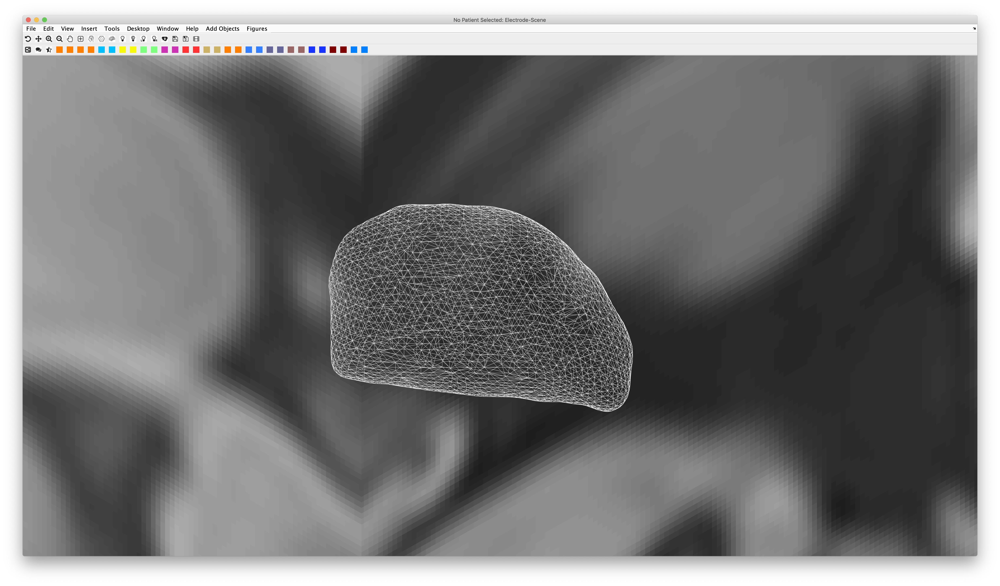

# Matlab scripting examples

We will list useful scripts / command-line calls that are shipped within Lead-DBS on this site. Please note that a lot of these scripts are buggy and may not be well maintained. Also, the documentation may be outdated. But they provide some insight about useful tools for expert users.

## 3D Visualization / Elvis viewer

### ea\_mnifigure

```
ea_mnifigure(atlasname);
ea_mnifigure('DISTAL Minimal (Ewert 2017)');
```

This snippet will open the 3D viewer "Elvis" of Lead-DBS with an atlas. It is a normal MATLAB figure, so you can then plot additional content onto it.

### ea\_keepatlaslabels

```
ea_keepatlaslabels('on'); ea_keepatlaslabels('off');
ea_keepatlaslabels('STN');
```

This call will hide all atlas structures from an open viewer that are not specified in the script.

### ea\_setplanes

```
ea_setplanes(X,Y,Z);
ea_setplanes(0,-30,nan); % will not show the z-plane at all
```

This call will move or hide (when supplying NaN) the MRI planes to specific mm values.

### ea\_view

```
v = ea_view();
ea_view(v);
```

Store the current 3D view (v = ea\_view;) as variable v or set the current 3D view to the view stored in v.

### Elvis scripting example scripts

```
ea_mnifigure('DISTAL Minimal (Ewert 2017)'); % open up Elvis viewer
ea_keepatlaslabels('GPI'); % hide all structures except GPi
load([ea_space([],'atlases'),'DISTAL Minimal (Ewert 2017)',filesep,'atlas_index.mat']); % manually load definition of DISTAL atlas.
rSTN=atlases.roi{1,1}.fv; % extract the right STN.
rSTN=reducepatch(rSTN,0.5); % reduce patch a bit.
patch('Faces',rSTN.faces,'Vertices',rSTN.vertices,'facecolor','none','edgecolor','w'); % visualize the right STN as wireframes.
lSTN=atlases.roi{1,2}.fv; % do the same for the left STN.
lSTN=reducepatch(lSTN,0.5);
patch('Faces',lSTN.faces,'Vertices',lSTN.vertices,'facecolor','none','edgecolor','w');
ea_setplanes(0,-30,nan); % set planes to a nice view.

% now define a specific camera view:
v.az= 126.0430;
v.el= -34.9893;
v.camva= 0.4648;
v.camup= [0 0 1];
v.camproj= 'orthographic';
v.camtarget= [-1.2419 -23.0911 3.9242];
v.campos= [1.0973e+03 1.0671e+03 -1.0542e+03];
ea_view(v); % apply view.
```



## Export / Data Visualization

### ea\_surfice

```
ea_surfice(nifti);
ea_surfice('/path/to/your/nifti/file.nii');
ea_surfice('/path/to/your/nifti/file.nii',[threshs],[sides=2],[colorbar=false],smoothed);
```

Overlay a nifti file to the MNI space surfice templates and export results as png.

## Coordinates and image manipulation

### Querying electrode placement

Electrode coordinates are stored inside the `ea_reconstruction.mat` files inside patient folders and also in the `M.elstruct` variable of the `Lead_groupanalysis.mat`files of Lead group projects.

```
XYZ=reco.mni.coords_mm{1}
```

will deliver the right-hemispheric (`{1}`) x (laterality), y (anterio-posterior axis) and z (dorso-ventral / superior-inferior axis) coordinates in template space. Usually (by default) these will be within ICBM 152 2009b Nonlinear Asymmetric space, the most modern and precise "MNI space". See [here](https://www.lead-dbs.org/about-the-mni-spaces/) for more about different spaces. Left hemispheric electrodes will be stored in the second cell (`{2}`). To get coordinates in native subject space, use the `reco.native.coords_mm` (before brain shift correction, i.e. inside the postoperative volume) or the `reco.scrf.coords_mm`entry (after brain shift correction, i.e. inside the anchor modality. Note that those are **not** ACPC coordinates.

By default, ACPC coordinates are not computed, but this can be done. To enable it, change the line `prefs.reco.saveACPC=0;`to `prefs.reco.saveACPC=1;` within the preferences file (to open the preferences file hit cmd+P in the Lead-DBS main GUI.

Once this flag is enabled, the `reco`variable will have another entry called `acpc`with the same logic.

If you are dealing with more than two electrodes, the `reco.space.` cells will have more than two entries but usually, right hemispheric electrodes should be stored in the first and left in the second entry.

Inside these entries, contacts are numbered from bottom to top, for instance

```
XYZ=reco.scrf.coords_mm{2}(3,:)
```

will deliver the left hemispheric (`{2}`) third most ventral (`(3,:)`) contact inside the native space anchor modality (which is usually the T1 image). Of note, those are usually not that useful and not comparable across subjects. The `mni` or `acpc` coordinates are and we strongly suggest using `mni`coordinates for comparisons or statistical analyses.

### ea\_spherical\_roi

This function will make a spherical region of interest around a user identified mni coordinates. It takes file name, mni coordinates in (mm), radius (in mm), and path of space template file in which the sphere will be identified, as arguments

```
ea_spherical_roi('/path/to/your/nifti/file_name.nii',mni_coordinates,radius_in_mm,crop,'/path/to/your/nifti/template_image.nii');
ea_spherical_roi('/Computer/Desktop/spherical_rois/DBS_ET.nii',[-14,-18.5,-2],1,1,'/Computer/lead/templates/space/MNI_ICBM_2009b_NLIN_ASYM/t1.nii');
```

### ea\_vox2mm

Converts voxel-coordinates to mm-coordinates. Coordinates need to be row vector: N\*3

```
ea_vox2mm(vox, transform);
ea_vox2mm([122,220,133],'/Computer/lead/templates/space/MNI_ICBM_2009b_NLIN_ASYM/t1.nii');

ans =

  -37.5000  -24.5000   -6.0000
```

### ea\_flip\_lr\_nonlinear

Flip files / coords nonlinearly from Left to Right hemisphere (or vice versa) based on asymmetric template

```
ea_flip_lr_nonlinear(from,to,interp)
ea_flip_lr_nonlinear('/Computer/Desktop/spherical_rois/DBS_ET.nii','/Computer/spherical_rois/DBS_ET_flipped_to_right.nii',1);
```
