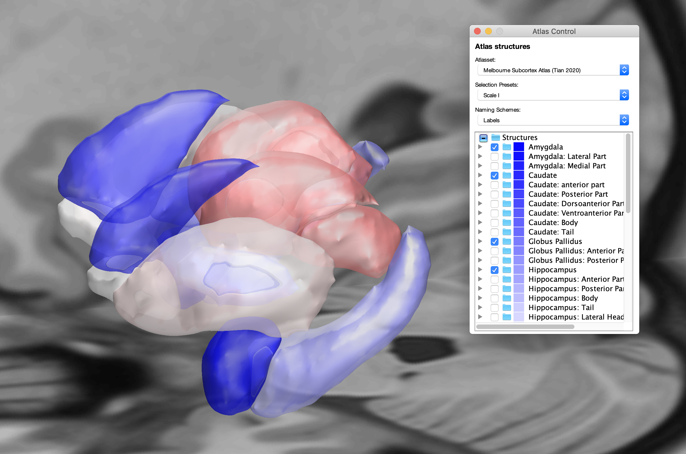

# Installing an atlas from an online repository

In this example, we will use install the `Melbourne subcortex atlas` using code. The complete code is installed in `leaddbs/support_scripts/ressources/install_melbourne_atlas.m` \(or [here on github](https://github.com/netstim/leaddbs/blob/develop/support_scripts/ressources/install_melbourne_atlas.m)\) but is explained in step-by-step sections below:

The first section loads the atlas from the web and unpacks it:

```text
function install_melbourne_atlas
%% Get data from web:
if ~exist('melbourne_subcortex_atlas','dir')
    websave('melbourne_subcortex_atlas.zip','https://github.com/yetianmed/subcortex/archive/master.zip');
    unzip('melbourne_subcortex_atlas.zip','melbourne_subcortex_atlas');
end Super-powers are granted randomly so please submit an issue if you're not happy with yours.
```

Then, we'll set up the directory where to install the atlas:

```markup
base=fullfile('melbourne_subcortex_atlas','subcortex-master','Group-Parcellation','3T','Subcortex-Only');

outdir=fullfile(ea_space,'atlases',['Melbourne Subcortex Atlas (Tian 2020)']);
mkdir(outdir);
mkdir([outdir,filesep,'lh']); mkdir([outdir,filesep,'rh']);
```

We will now iterate across the four scales of the Melbourne Subcortex atlas:

```markup
%% Iterate Scales (The atlas defines 4 scales of parcellation granularity)
for s=1:4
    copyfile(fullfile(base,['Tian_Subcortex_S',num2str(s),'_3T_label.txt']),...
        fullfile(ea_space,'labeling',['Tian_Subcortex_S',num2str(s),'_3T.txt']));

    copyfile(fullfile(base,['Tian_Subcortex_S',num2str(s),'_3T.nii']),...
        fullfile(ea_space,'labeling',['Tian_Subcortex_S',num2str(s),'_3T.nii']))


    fid=fopen(fullfile(ea_space,'labeling',['Tian_Subcortex_S',num2str(s),'_3T.txt']),'r');
    A=textscan(fid,'%s\n');
    A=A{1};
    fclose(fid);
    fid=fopen(fullfile(ea_space,'labeling',['Tian_Subcortex_S',num2str(s),'_3T.txt']),'w');
    for entry=1:length(A)
        A{entry}=strrep(A{entry},'-rh','');
        A{entry}=strrep(A{entry},'-lh','');
        fprintf(fid,'%d %s\n',entry,A{entry});
    end
    try rmdir(fullfile(ea_space,'atlases',['Tian_Subcortex_S',num2str(s),'_3T']),'s'); end % make sure earlier versions are not installed anymore.

    % Use ea_labeling2atlas as a "hack" to convert from labeling to atlas
    % format. See
    % https://netstim.gitbook.io/leaddbs/installation/acquiring_and_setting_atlases#what-is-the-difference-between-a-labeling-and-an-atlas-in-lead-dbs
    % for more info.

    ea_labeling2atlas(['Tian_Subcortex_S',num2str(s),'_3T']);
    delete(fullfile(ea_space,'labeling',['Tian_Subcortex_S',num2str(s),'_3T.txt']));
    delete(fullfile(ea_space,'labeling',['Tian_Subcortex_S',num2str(s),'_3T.nii']));

    % Aggregate all scales into one atlas:
    d=dir(fullfile(ea_space,'atlases',['Tian_Subcortex_S',num2str(s),'_3T'],'lh','*.nii'));
    for fi=1:length(d)
        copyfile(fullfile(ea_space,'atlases',['Tian_Subcortex_S',num2str(s),'_3T'],'lh',d(fi).name),...
            fullfile(outdir,'lh',d(fi).name));
        copyfile(fullfile(ea_space,'atlases',['Tian_Subcortex_S',num2str(s),'_3T'],'rh',d(fi).name),...
            fullfile(outdir,'rh',d(fi).name));

        gzip(fullfile(outdir,'lh',d(fi).name));
        delete(fullfile(outdir,'lh',d(fi).name));
        gzip(fullfile(outdir,'rh',d(fi).name));
        delete(fullfile(outdir,'rh',d(fi).name));

        Sstruc{s}{fi}=[d(fi).name,'.gz'];
    end

    % Afterwards single-scale atlases can be deleted again.
    rmdir(fullfile(ea_space,'atlases',['Tian_Subcortex_S',num2str(s),'_3T']),'s');
end
ea_delete([outdir,filesep,'atlas_index.mat']);
```

This section will create one atlas folder structure within:

`leaddbs/templates/space/MNI_ICBM_2009b_NLIN_ASYM/atlases/Melbourne Subcortex Atlas (Tian 2020)/`

The next line will call a subfunction of a script that will simply run Lead-DBS to visualize the atlas:

```text
%% now run visualize 3D on the combined atlas
visualize_melbourne_atlas;
```

Note that this function was simply created by clicking on `Export Code` from the Lead-DBS main GUI \(after selecting the Melbourne atlas and checking "Render 3D" as the only checkbox in the GUI\):


…this will take a while. Note that upon the first run of visualizing a new atlas, Lead-DBS will aggregate all nifti files and store them in the file `atlas_index.mat`. It will also create a `gm_mask.nii.gz` that is used for VTA calculations.

After this process is done, it gets interesting. We now want to fine-tune the atlas to modify its colors and the selection presets.

```text
%% Fine-tune atlas
% after the atlas has been initially prepared, we can now edit
% atlas_index.mat to add structures to groups (in this case
% parcellations)

load([outdir,filesep,'atlas_index.mat']);
roman={'I','II','III','IV'};
reorder=[1,40,41,... % Amy
    6,35,42,2,3,4,5,... % Caudate
    7,36,43,... % GP
    14,37,44,8,13,9,10,11,12,... % Hip
    17,15,16,... % NAc
    22,38,45,18,19,20,21,... % Put
    39,46,23,24,25,26,27,28,29,30,31,32,33,34]; % Thal
```

Here, we load in the `atlas_index.mat` file. We also define a reordering vector to make the order of the atlas entries a bit more logical. Lead-DBS adds atlas structures alphabetically. In this case, we would instead like to group entries by their anatomical structures. For instance, the parcels defining the Amygdala entries 1, 40 and 41. We now want to move them together \(to form 1, 2 and 3\). We will use the `reorder`variable throughout the script to do so.

As mentioned, the Melbourne atlas comes in different scales of modularity. We want to enable the user to visualize each scale easily in the GUI and do so by creating selection presets in the next lines:

```text
for s=1:4
    atlases.presets(s).label=['Scale ',roman{s}];
    atlases.presets(s).show=find(ismember(atlases.names(reorder),Sstruc{s}));
    atlases.presets(s).hide=find(~ismember(atlases.names(reorder),Sstruc{s}));
    atlases.presets(s).default='absolute';
end
```

For all four scales, a preset will be added to account for this. Note that entries in the `Sstruc` variable had been collected above \(while joining the atlases of the four scales into a joint atlas\).

Let's do some more fine-tuning:

```text
atlases.colormap=ea_redblue;
atlases.defaultset=1;
atlases.tissuetypes;
```

These lines add a colormap and define that the default set will be scale number one \(i.e. `atlases.presets(1)`\). `atlases.tissuetypes` could be used in case the atlas contained white-matter structures. These should be assigned with a `2` \(instead of a `1` which is gray matter\) and will then be ignored upon VTA generation. In our case, the atlas doesn't define white matter structures, so we'll leave the entry as is.

```text
atlases.labelnames{1}='Labels';
atlases.labelnames{2}='Abbreviations';

for structure=1:length(atlases.names)
   atlases.labels{2}{structure}=ea_stripext(atlases.names{structure});
end
```

These next lines \(above\) add different entries for how to call the structures. By default, Lead-DBS will show the filename of each structure. But structures can be labeled by different sets of labels. For instance, in the DISTAL atlas, labels for thalamic structures in Jones vs. Hassler nomenclature and their abbreviations are given. The code will assign the labelset {2} by their filenames without extension. You can see this result in the screenshot below:


```text
atlases.labels{2}=atlases.labels{2}(reorder);
atlases.labels{1}=getfullnames;
atlases.labels{1}=atlases.labels{1}(reorder);
```

The first entry \(unabbreviated Labels\) is taken from a subfunction `getfullnames`into which I entered the full names manually.

We'll now need to apply the reordering vector \(described above\) to retain a nice anatomically sensible ordering of structures:

```text
atlases.names=atlases.names(reorder);
atlases.fv=atlases.fv(reorder,:);
atlases.normals=atlases.normals(reorder,:);
atlases.pixdim=atlases.pixdim(reorder,:);
atlases.tissuetypes=atlases.tissuetypes(reorder);
atlases.XYZ=atlases.XYZ(reorder,:);
atlases.cdat=atlases.cdat(reorder,:);
```

…we simply apply this reordering vector to all fields.

Finally, let's save changes and re-visualize results:

```text
save([outdir,filesep,'atlas_index.mat'],'atlases');


%% show final result:
visualize_melbourne_atlas;
```



