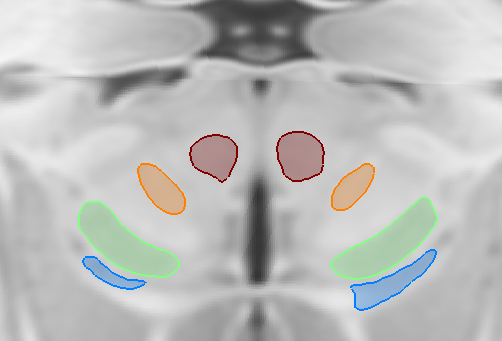

# Plotting atlas structures onto 3D slices

Using this following code, which utilizes the `ea_plot2datlasstruct` function found in the /support\_scripts folder of your Lead-DBS installation, you can plot atlas structures onto the slices in the 3D viewer (ElVis) such as seen in the figure below:

`path=[ea_space([],'atlases'),'DISTAL Nano (Ewert 2017)'];`\
`load([path,filesep,'atlas_index.mat'])`\
`atlas = atlases;`\
`clear atlases`\
`plane = 'x';`\
`coord = -13;`\
`thr = 0.5;`\
`ea_mnifigure('DISTAL Nano (Ewert 2017)')`\
`ea_plot2datlasstruct(path, atlas, plane, coord, thr)`&#x20;

<figure><figcaption>
Atlas structures projected onto the 3D viewer in MNI space using the above code snippet.
</figcaption></figure>

