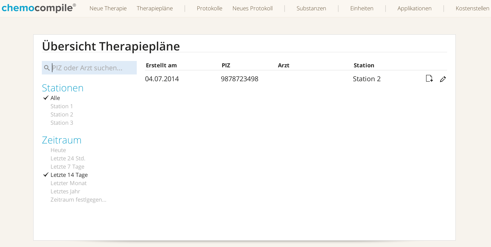

# Aufbau der Software

Im folgenden werden die Hauptbedienelemente von ChemoCompile aufgeführt und erklärt.

*Abb. 3.1:* Startbildschirm der ChemoCompile Software. Im oberen Bereich findet sich das `Hauptmenu`. Hier finden Sie die grundlegendsten Funktionen der Software.

- Mit `Neue Therapie` kann eine neue Chemotherapie angelegt und geplant werden.
- Mit `Therapiepläne` können bereits angelegte Therapien eingesehen, verändert und verwaltet werden.
- Unter `Protokolle` finden Sie den Protokolldatenbestand der Software.
- Mit `Neues Protokoll` öffnet sich der Protokolleditor, ein neues Protokoll kann angelegt werden, um anschließend in der Klinik als auf den Patienten angepasste Therapie Verwendung zu finden.
- Unter `Verwalten → Substanzen` finden Sie einen Editor für Medikationen, die in den Protokollen verwendet werden. Hier können Sie Medikamentennamen verändern, neue Medikamente anlegen, sowie Medikamente löschen.
- Unter `Verwalten → Einheiten` findet sich ein ähnlicher Editor für die Einheiten, die bei der Applikation von Medikamenten verwendet werden können.
- Unter `Verwalten → Applikationen` ist ein ähnlicher Editor für die Applikationsarten zu finden.
- Letztlich können unter `Verwalten → Kostenstellen` die möglichen Kostenstellen, bzw. Stationen der klinischen Einrichtung eingetragen und verwaltet werden.

Der Zugriff auf die verschiedenen Bereiche der Software ist nicht für alle Nutzer gleichsam möglich und wird durch ein Rollenbasiertes Rechte-Management geregelt. Beispielsweise kann nicht jeder Nutzer neue Protokolle oder Medikamente anlegen. Ein anderes Beispiel: Die Rechte für eine neue Therapieplanung sollten so eingestellt werden, dass nur ärztliches Personal diese Funktion ausführen darf.
