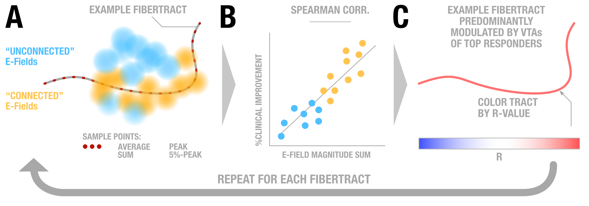
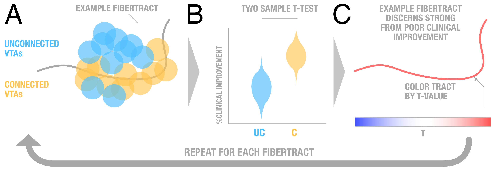

# Discriminative Fibertracts analysis

## Discriminative Fibertracts Analysis

The concept of discriminative fibertracts is to isolate bundles that are associated with an effect upon neuromodulation. This effect could be e.g. clinical \(e.g. %-UPDRS-III improvement following STN-DBS\) or behavioral \(e.g. change in risk-taking behavior or movement speed in a motor task\).

This analysis builds upon [Lead group](../../group_analyses_with_lead-dbs.md). It is important to have all VTAs/E-Fields calculated for this \(press the `Calculate stats & VTA` button\).

Click on the `Visualize 3D` button inside `Lead group`.

In the 3D viewer, click on the "`Add discriminative fibertract`" button:


In this analysis stream, you have to once calculate tract metrics for any combination of normative connectomes and statistical metric. Once this is done, you can explore the results more or less "live"


In the 3D fibers viewer, choose your metric of choice. The following metrics have been implemented:

### Spearman's Correlations / E-Fields

In this method, each single tract is selected from the normative connectome. The statistics are calculated for each tract _separately_. In the figure above, one _example tract_ can be seen \(A\). Note how parts of this tract traverse "through" some of the E-Fields estimated in your `Lead Group` analysis \(shown in yellow\). They traverse less closely to the ones shown in blue but will still traverse through areas of those E-Fields that have a lower magnitude sum \(remember that the E-Field is the estimated vector field denoting changes in Voltage induced by the stimulation. It's magnitude would be the absolute difference of Voltage between two points\).

**Fig. 1 A:** Each tract is represented as discrete points in space \(N x 3 vector if N is the length of the tract; red dots in \(A\)\). The average values at these points for each E-Field \(regardless as yellow or blue in A\) will be sampled. Depending on your strategy / concept \(see below\), these values can now be averaged or summed up. Alternatively, you can simply use the peak value \(more conforming to the "all or nothing" principle of action potentials\) or the 5% peak values. This strategy will lead to one value for each pair of tract and E-Field \(N x M if N is number of tracts and M is number of E-Fields; represented as `fibsval` for each hemisphere in the code\).

**Fig. 1 B:** When calculating Spearman's correlations between this structure and a clinical/behavioral variable \(e.g. %-UPDRS-III improvement\), we will get one Spearman's correlation coefficient for each tract.

**Fig. 1 C:** We can now use these coefficients \(R\) to color-code and select tracts for visualization.

### Two-sample T-Tests / VTAs

In this method, the same is done for binary VTAs \(which in the case of Lead-DBS are thresholded E-Fields\).

**Fig. 1 A:** Each tract can either be connected or not connected to any VTA. Thus, each single tract splits the group of VTAs \(in template space\) into two sets.

**Fig. 1 B:** When calculating Two-sample T-tests between a clinical/behavioral variable \(e.g. %-UPDRS-III improvement\) observed in the group of connected vs. unconnected VTAs, we will get a T-value for each tract.

**Fig. 1 C:** We can now use these values \(T-scores\) to color-code and select tracts for visualization.

