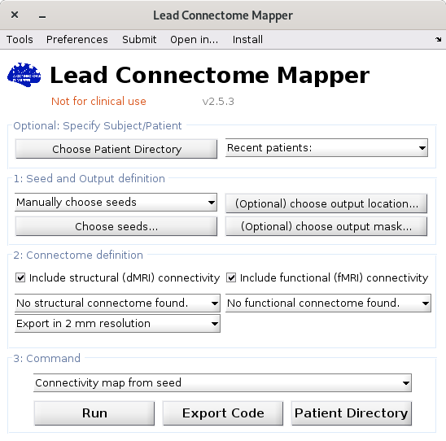
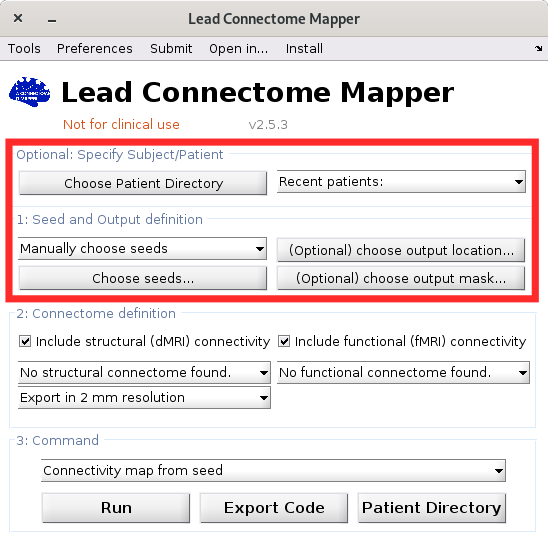
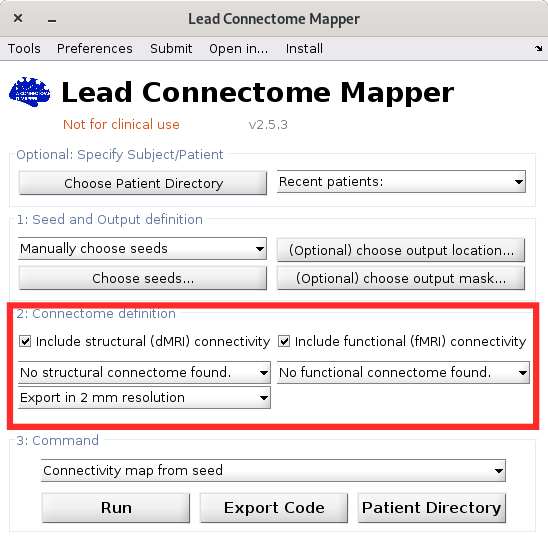
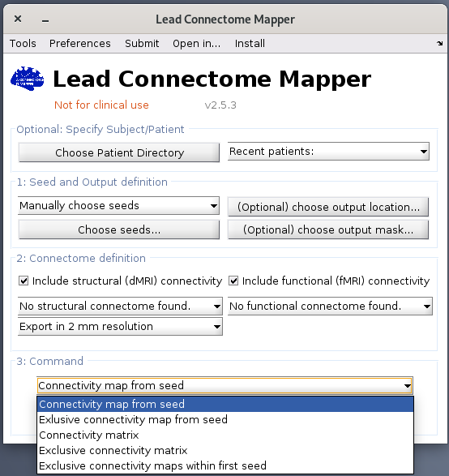
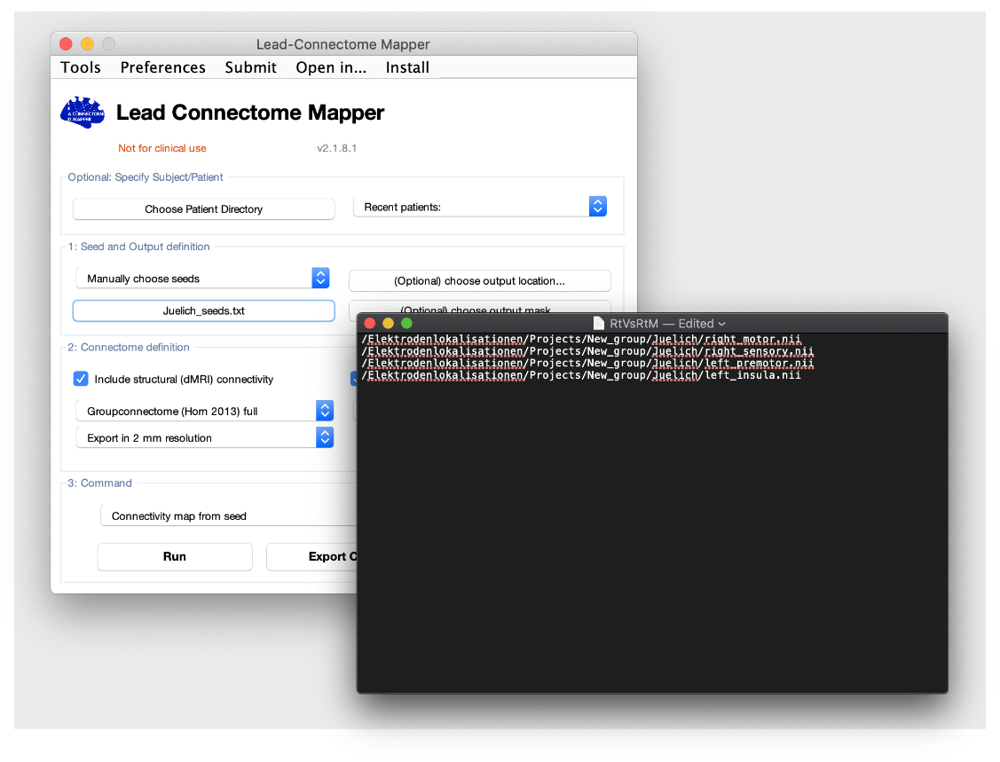
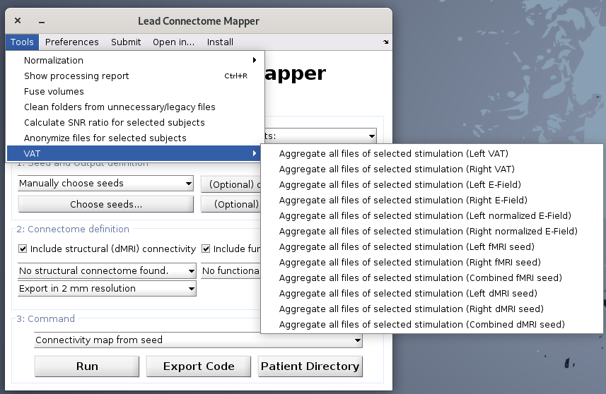

# Lead Connectome Mapper

Lead Connectome Mapper can compute seed-based structural and functional connectivity from VTAs to the whole brain. There are multiple connectomes to select from. Any of these options can be downloaded using the 'install' drop down menu from LEAD mapper. Below is a written tutorial, you may also watch [the walkthrough tutorial video](https://www.lead-dbs.org/helpsupport/knowledge-base/walkthrough-videos/) (from 01:07:00).

To run VTA-based connectivity, choose one or multiple patient folders containing VTAs models calculated with Lead DBS or Lead Group and drag them to 'Choose Patient Directory' panel. Go to 'Manually choose seeds' and change it to the folder name that appears automatically after selecting patient folders. This will allow Lead Connectome Mapper to access the folder containing VTAs in each patient folder.

You can choose to perform structural, functional or both by ticking the box next to each modality in the 'Connectome definition' panel. For structural connectivity, you can further define the resolution of the connectivity map (2, 1 or 0.5 mm resolution).

The Command panel at the bottom selects whether to extract connectivity maps (nifti images) or connectivity matrices.

You can run seed-based connectivity by defining a brain seed that is not a VTA. In this case, Lead Connectome Mapper calculates the selected connectivity from this seed to the whole brain as it calculates it for VTAs. For instance you can calculate the connectivity from the motor cortex, which we define from a parcellation atlas of the brain and prepare as nifti image. This can be fed to Lead Connectome Mapper by choosing the seed manually.

You can run multiple seeds to whole-brain connectivity by choosing a text file you prepared with a text editor containing the path to the seeds in your computer

Another useful tool in Lead Connectome Mapper is the VAT item in the Tools menu. It aggregates VAT (VTA) nifti files from selected patients folders to a specific place. You can aggregate VATs according to side of the brain or as combined bilateral VAT images. This will basically copy the VAT mask files to the specified folder you select in addition to a text file containing a list of VATs path. Another feature is to select among structural or functional VAT and whether you want to extract the E-field of the VAT binary mask nifti images.

