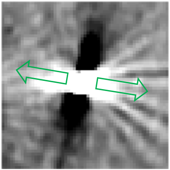

# Possible Problems with the Automatic Algorithm

## 1. Wrong Direction of the Marker Artifact

Unfortunately the CT artifact generated by the stereotactic marker shows almost complete symmetry and thus it is very difficult for any algorithm to define the direction in which the marker is pointing. There are always two possible solutions to this problem, the first being the right one with the correct electrode roll angle, and the second being the exact opposite direction and a roll angle shifted by 180 ° :

_Legend: Example of the artifact generated by the stereotactic marker. The two possible lead orientations are depicted as green arrows._

While the algorithm tries to identify the real direction, this step is prone to error. However, in most cases one has at least some assumption about the orientation of the lead, for example due to the standard surgical practice in the respective center or due to intraoperative imaging. Since an accidental misorientation of 180 ° is very unlikely, one can thus infere which of the two possible solutions reflects the real marker orientation.

If you suspect, that the algorithm has chosen the false solution, and that the stereotactic marker actually points in the opposite direction, you can manually select the other solution after clicking the [Manual Refine](user-assisted-algorithm-manual-refine.md) button.

## 2. Suboptimal Slice Selection and Suboptimal Artifact Centers

The algorithm automatically selects the slices where it expects the artifacts of the stereotactic marker and the segmented electrodes to be most visible based on the results from the manual reconstruction. Additionally it determines the center of the lead based on the reconstructed coordinates. However both slice detection and artifact center detection can be inaccurate especially when the reconstruction process has been done haphazardly, if the CT slice thickness is too large, or if lead trajectories run very parallel to the CT scanner axis \(large polar angles\).

In this case slices and artifact centers can be respecified after clicking the [Manual Refine](user-assisted-algorithm-manual-refine.md) button.

