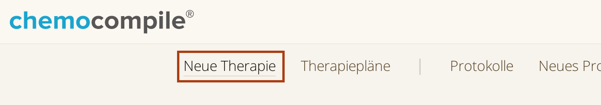
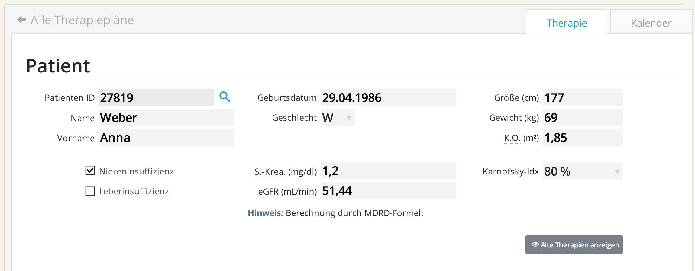

# Ein kurzer Rundgang durch die Therapieplanung mit ChemoCompile

Bevor wir mit einer detaillierten Beschreibung der einzelnen Funktionen der Software beginnen, möchten wir Ihnen in diesem Kapitel einen schnellen Überblick über die wichtigsten Funktionen von `ChemoCompile` geben.

Mit `ChemoCompile` geplante _Therapien_ basieren auf _Chemotherapie-Protokollen_, welche entweder

• aus der umfassenden, mitgelieferten Protokollbibliothek
• aus Ihrer selbst erstellten Protokollbibliothek

stammen können. Alternativ können Sie eine Therapie komplett ohne Vorlage planen, also mit einem “leeren Blatt” beginnen.

**Anlegen und Verwalten einer Therapie**

>☛ Wählen Sie `Neue Therapie` im `ChemoCompile`-Hauptmenu (obere Bedienleiste).

*Abb. 4.1:* Das `ChemoCompile`-Hauptmenu.

Es erscheint ein neues Blatt, auf welchem Sie die Therapiedetails ausfüllen können.

>☛ Geben Sie nun im oberen Bereich ("`Patient`") die Patientendaten ein.

*Abb. 4.2:* Die Stammdaten in einer Therapieplanung.

Im darunter folgenden Bereich "`Protokoll`" können Sie ein _Protokoll_ als Therapievorlageschema wählen.

>☛ Tippen Sie einen Protokollnamen in das Feld `Protokollname`, um direkt passende Therapievorschläge zu sehen, oder klicken Sie auf den Button `Zur Protokoll-Bibliothek`, um ein passendes Protokoll auszuwählen.

Nachdem ein passendes Protokoll gefunden wurde, füllt `ChemoCompile` automatisch die Therapiedaten aus. Sie können Ihre Therapie selbstverständlich auch ohne Vorlage (“leeres Blatt”) erstellen. Geben Sie hierfür einfach einen gewünschten Therapienamen in das Feld `Protokollname` ein.

>☛ Wählen Sie eine `Diagnose` und einen `Therapiebeginn`.

Hiermit wird die Therapie für den ersten Zyklus geplant.

>☛ Wenn Sie mehrere Zyklen planen möchten, geben Sie alle zu planenden Zyklen kommasepariert in das Feld `Zyklus` ein. Die Zyklus-Details für alle Zyklen erscheinen nun untereinander und können anschließend einzeln angepasst werden. Bitte beachten Sie, dass die Planung mehrerer Zyklen vor allem bei Multizyklenprotokollen sinnvoll ist.

`ChemoCompile` fasst alle Veränderungen, die Sie an einer Therapie vornehmen in einer Liste unter `Modifikationen` für Sie zusammen. An dieser Stelle können Sie Veränderungen auch leicht rückgängig machen.

> ☛ Geben Sie zuletzt im Bereich `Sonstige Informationen` Notizen oder wichtige Informationen zur Therapie ein und wählen Sie eine Kostenstelle/Station im Bereich `Kontakt`.

**Ihre Therapie ist fertig.**

> ☛ Sie können die Therapie nun `speichern` und finden Sie unter `Therapiepläne` im `ChemoCompile`-Hauptmenu wieder.

> ☛ Von dort aus können Sie die Therapie `bearbeiten`, `freigeben` und `archivieren`. Je nach Konfiguration erfordern diese Schritte u.U. gesonderte Rechte. Meist ist `ChemoCompile` so konfiguriert, dass:

- das Speichern und Bearbeiten der behandelnde Arzt selbst vornimmt,
- die Freigabe und Archivierung hingegen von einem gesonderten Team, z.B. “Good-Clinical-Practice”-Team oder entsprechend ausschließlich von Fach-/Oberärzten vorgenommen wird.

> ☛ Nachdem Sie eine Therapie geöffnet haben, oder während Sie sie bearbeiten, können Sie durch Klick auf den Reiter `Kalender` im oberen Bereich der Therapie zur Kalenderansicht wechseln.

Hierdurch bekommen Sie stets einen schnellen Überblick über die Zeitplanung Ihrer Therapie. Im oberen Bereich der Kalenderansicht können Sie zwischen der Ansicht im Kalenderformat und der Ansicht als Liste wechseln.

> ☛ Klicken Sie auf einen blauen Bereich in der Kalender- oder Listenansicht, um ein _Kurvenblatt_ zu öffnen.

Zur Erinnerung: ein _Kurvenblatt_ bezeichnet die spezifische Information für einen Therapietag.
Kurvenblätter fassen den Ablauf eines Therapietages z.T. minutengenau zusammen und dienen in der praktischen Anwendung zur optimalen Planung und Verabreichung der Medikation an einem bestimmten Tag.

`ChemoCompile` ermöglicht es Ihnen, die Therapien der einzelnen Tage im Handumdrehen zu modifizieren.

> ☛ Klicken Sie hierzu auf die Schaltfläche `Bearbeiten`, nachdem Sie einen Tag ausgewählt haben, um das tagesspezifische Kurvenblatt anzupassen.

Sie können ihre neu angelegte Therapie stets unter dem Punkt `Therapiepläne` im `ChemoCompile`-Hauptmenu aufrufen und an diesem Ort verwalten.

_Dies war ein kurzgefasster Rundgang durch die Therapieplanung mit ChemoCompile. Lesen Sie in den folgenden Abschnitten des Handbuchs detailliertere Angaben zu spezifischen Punkten der Therapieplanung, sowie zum Anlegen von eigenen Protokollvorlagen, der Verwaltung von Kostenstellen, Arzneimitteln, Applikationsarten und Arzneimittel-Dosierungen._
