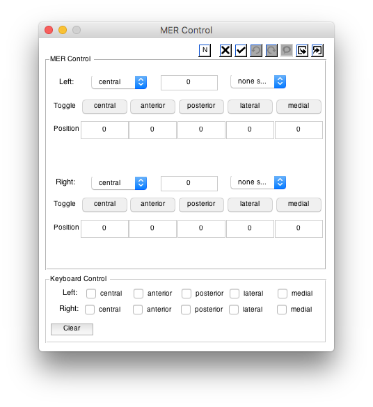

# MER analysis

## MER Localization in LEAD-DBS

To enter the MER viewer, click on the button shown below located in the toolbar of the _Lead-DBS_ 3D viewer:

### Load MER Localizer

Clicking the MER icon in the 3D viewer toolbar will give you a reconstruction of the MER locations based on the lead localization, and a new MER Control GUI.

## 

1. Choose the implanted tract from the dropdown menu near`Right`or`Left`
2. Toggle the implanted tracks on and off`Central, Anterior, Posterior, Lateral, Medial`.
3. Change the location of the MER site by:

   * Entering the position in the edit box

   OR

   * Using the arrow keys to change the position along the track
     * Hold

       `Shift`

       to increase step size.

     * Hold

       `option`

       to decrease step size. - note: Choose a toggle button for the electrode of interest.

4. Mark a recording site using keyboard shortcuts. Reserved keys:
   * `spacebar = "generic"`
   * `m = "MER"`
   * `l = "LFP"`
   * `t = "Top"`
   * `b = "Bottom"`
5. Use the`export markers`button in the MER Control GUI to save markers as a`.mat`file.

