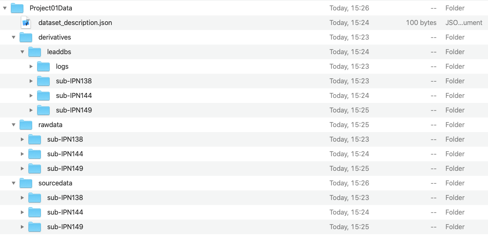
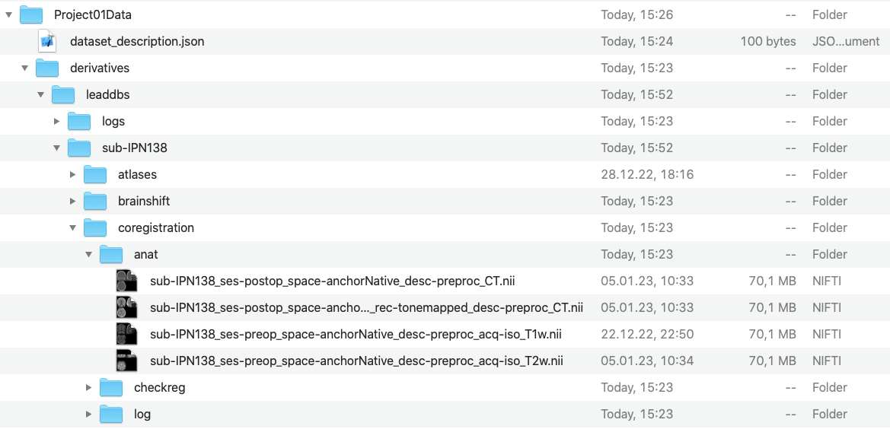

# Overview

### BIDS STRUCTURE

Brain Imaging Data Structure ([https://bids.neuroimaging.io/](https://bids.neuroimaging.io/)) is an effort by the neuroimaging community to organize and standardize data with the objective of making it efficient, sharable and accessible throughout the community. Though there is no specific BIDS structure for DBS data, we recognize the importance of data standardization and thus, with the release of Lead-DBS v3.0, we have adopted elements of this structure into Lead-DBS.&#x20;

#### Data Organization

Specifically, project data is now organized with one overarching "Dataset Directory". This dataset directory will host the _sourcedata_ (data from the scanner, for e.g., DICOM images), _rawdata_ (data converted from DICOM to NIFTI) and _derivatives_ (preprocessed data) folder. The screenshot below is illustrative of this folder structure. \
The _rawdata_ folder further contains the preop and postop session folder - each of which contains a folder for anat, functional and dMRI data.\
The most extensive of these folder is the _derivatives_ folder. The first child of the derivatives folder is named _leaddbs_ and denotes all outputs of the lead-dbs pipeline. Here, you can place a folder derived from other softwares, for e.g., fMRI-prep. The leaddbs folder contains data from each subject in your study. Each preprocessing step is reflected with a folder inside the subject folder, for e.g., coregistration, normalization, localization, and so on. Coregistration and normalization folders have further subfolders for storage of image files (_anat_), .png files for checking the accuracy of registration (_checkreg_), configuration files (_log_) and transformation files in the .mat format (_transformations_).\
A folder called prefs inside the said derivatives/leaddbs/sub-xxx contains a file called `sub-xxx_desc-rawimages.json` which configures leaddbs with the raw images. This is an important file, and is required to be correct for running Lead-DBS.&#x20;

<figure><figcaption>
BIDS folder structure containing a dataset directory (Project01Data) and its subdirectories: derivatives, rawdata and sourcedata.
</figcaption></figure>

#### Filenames

Filenames in lead-dbs have also significantly changed, with the objective of providing more information to the user about the subject, space, modality, acquisition, session and in some cases, the description denotes the pipeline used to derive it. Each filename contains a "key" and an associated "value"(for e.g., `sess-postop` where the "sess" is the key and "postop" is the value). Each key and value pair is separated from each other by a hyphen (-) and two such pairs are separated by an underscore (\_). Because these two special characters are used by filenames, they are henceforth "reserved" characters - this would mean that if you have any project data or subject names with these characters, it is best to remove them before proceeding. The image below provides examples of new filenames in the coregistration folder.\

<figure><figcaption>
Example filenames in the coregistration folder. The new filenames now provide more information on subject, space, modality and acquisition type.
</figcaption></figure>

### LEAD-DBS GUI

The app Lead-DBS is the main application of the Lead suite. It allows the reconstruction of electrodes for one patient or a batch of patients, if multiple folders are selected. To start, run `lead dbs`from the Matlab command prompt. The window below will pop up.

We explain steps 1 through 7 in more detail below, assuming a patient implanted bilaterally in the subthalamic nucleus. In brief:

<figure><figcaption>
Lead DBS Main Window
</figcaption></figure>

1. The user selects the patient folder and electrode type.
2. Patient images can be converted from DICOM to NIfTI and renamed interactively to fit the Lead-DBS naming convention.
3. The patient images are co-registered and if selected, normalized into MNI template space and corrected for brain shift. The user can check the results and manually refine the atlas fit.
4. (optional) The surface is reconstructed.
5. (optional) The electrode trajectories are pre-reconstructed. The user can choose between different methods, depending on the postoperative imaging modality. For instance, for postoperative CT, PaCER is an effective method. Afterwards, the user localizes the electrodes to refine the position and --- if applicable --- the orientation of the electrodes.
6. (optional) The user can run connectivity analysis with Lead Connectome.
7. The reconstructed electrodes can be visualized in 2D or 3D in template or patient space. The user can select from a comprehensive list of atlases.

<mark style="background-color:blue;">The button</mark> <mark style="background-color:blue;"></mark><mark style="background-color:blue;">`Run`</mark> <mark style="background-color:blue;"></mark><mark style="background-color:blue;">in the bottom right runs</mark> <mark style="background-color:blue;"></mark><mark style="background-color:blue;">**all**</mark> <mark style="background-color:blue;"></mark><mark style="background-color:blue;">processes that are checked within the main window.</mark> To run only one specific process, please make sure that only the desired checkbox is selected. Checkboxes marked with a **bold** text-face address steps that actually perform an analysis themselves, other checkboxes (standard text-face) are used as options within certain processes.

Hovering over the checkboxes with the mouse will show an explanation of each element of the Main Window.
