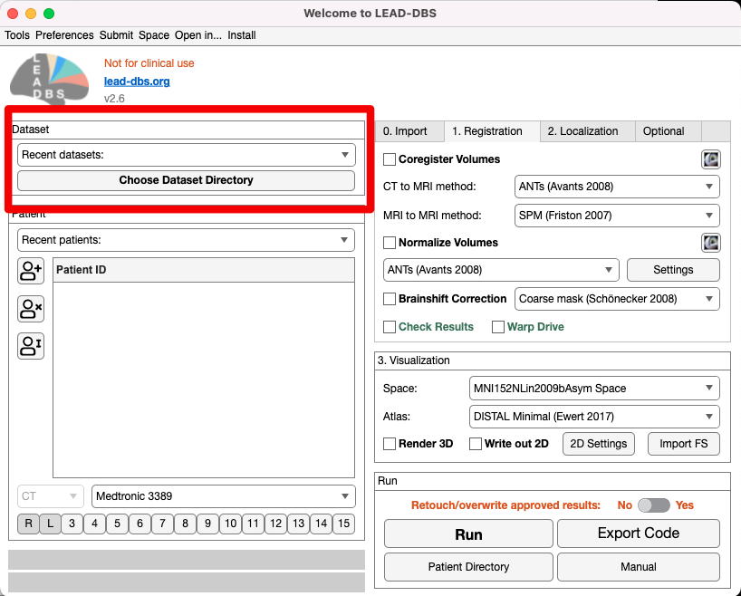
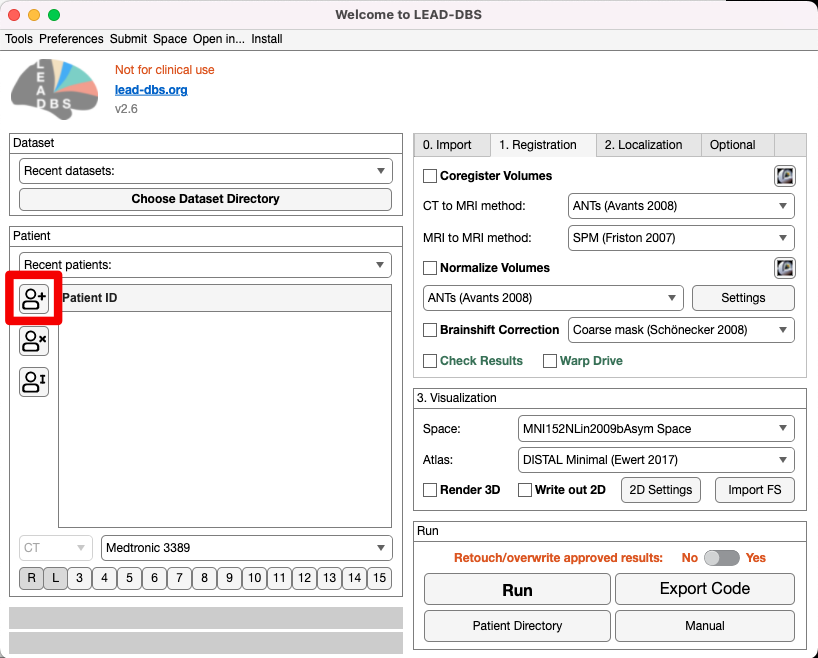
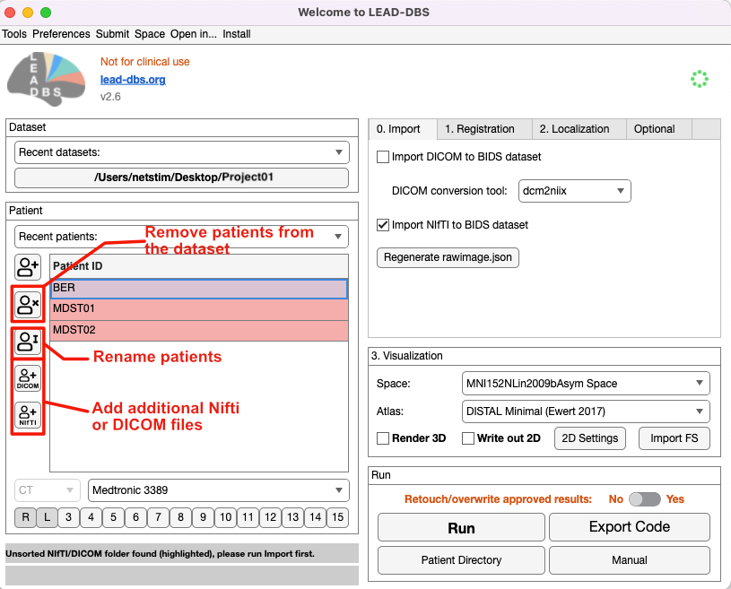

# 1. Load Patient Folder

<figure><figcaption></figcaption></figure>

Click on `Choose Dataset Directory` at the top of the main window to select the folder you would like to save your data to.&#x20;


<mark style="color:red;">**The name of this dataset directory should contain ONLY alphanumeric characters, but NO special characters, including underscores. It is also strongly recommended to**</mark><mark style="color:red;">** **</mark>_<mark style="color:red;">**not**</mark>_<mark style="color:red;">** **</mark><mark style="color:red;">**use reserved words such as**</mark><mark style="color:red;">** **</mark>_<mark style="color:red;">**leaddbs**</mark>_<mark style="color:red;">**,**</mark><mark style="color:red;">** **</mark>_<mark style="color:red;">**lead\_group**</mark>_<mark style="color:red;">**,**</mark>_<mark style="color:red;">**derivatives**</mark>_<mark style="color:red;">** **</mark><mark style="color:red;">**as the name of the dataset directory**</mark>.&#x20;


The name should reflect the project you are working on_._ You can use a folder already in BIDS format or select an empty folder. If you select an empty folder, Lead-DBS will automatically create 3 subfolders **(derivatives, rawdata, sourcedata)** and a json file **(dataset\_description.json)** within that folder. The resulting dataset folder should look like this:

<figure><figcaption>
An example folder in BIDS format.
</figcaption></figure>

**To add patients** to your dataset, click on the button shown below. Select the patient folder you want to add from the pop-up window. It is possible to hold shift and select multiple patients to import. Patient folders should contain preoperative and postoperative brain images. These files can be in DICOM, nifti or BIDS format.&#x20;

<figure><figcaption>
Add patients
</figcaption></figure>

<figure><figcaption>
Patient selection - it is possible to select multiple patients to import.
</figcaption></figure>

You can use the additional buttons shown below to remove patients, rename patients and to add additional nifti or DICOM images to the patients folder.

If your images are not in BIDS format, the folder will be highlighted in red as shown below. You need to convert the patient files to BIDS format from **0. Import** section, which is explained in the next section.&#x20;

<figure><figcaption></figcaption></figure>

**In the dropdown menu, select the electrode model and the number of electrodes.** By default, `R` and `L`are selected, i.e., a bilateral implantation in the right and left hemispheres is assumed. For some applications such as epilepsy, more electrodes may be applicable.

To analyze images, Lead-DBS needs **at least** the following views:

* for MR images, a post-operative image (at least a transversal view)
* for CT images, a post-operative acquisition plus a pre-operative MR image.

These images should be in the selected patient folder. **You may have more views and sequences available**, in which case electrode localization is made easier, more robust and more precise. These images can be in DICOM or NIfTI format. Lead-DBS needs to convert DICOM images into NIfTI (.nii) format as described in the [next step](step2-image-import/).

You can use the up and down arrows in this part to select the previous or next patient folder. For instance, you may have a folder `cohort`with patient folders `patient001`through to `patient010`and would like to move up or down between patient folders. The dropdown menu `Recent patients` provides quick access to recently analyzed patient folders.

The indicator at the bottom notifies whether a postoperative MR or CT image was detected. This can be changed with the [next step](step2-image-import/) after importing and renaming images.
