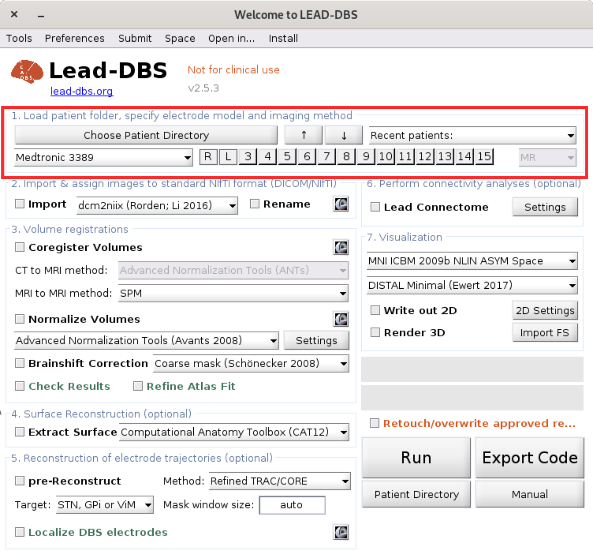

# 1. Load Patient Folder

Click on `Choose Patient Directory` at the top of the main window to select the patient folder. To analyze images, Lead-DBS needs at least the following views:

* for MR images, a post-operative image (at least a transversal view)
* for CT images, a post-operative acquisition plus a pre-operative MR image.

These images should be in the selected patient folder. You may have more views and sequences available, in which case electrode localization is made easier, more robust and more precise. These images can be in DICOM or NIfTI format. Lead-DBS needs to convert DICOM images into NIfTI (.nii) format as described in the [next step](step2-image-import.md).

In the dropdown menu, select the electrode model and the number of electrodes. By default, `R` and `L`are selected, i.e., a bilateral implantation in the right and left hemispheres is assumed. For some applications such as epilepsy, more electrodes may be applicable.&#x20;

You can use the up and down arrows in this part to select the previous or next patient folder. For instance, you may have a folder `cohort`with patient folders `patient001`through to `patient010`and would like to move up or down between patient folders. The dropdown menu `Recent patients` provides quick access to recently analyzed patient folders.

The indicator at the far right notifies whether a postoperative MR or CT image was detected. This can be changed with the [next step](step2-image-import.md) after importing and renaming images.
