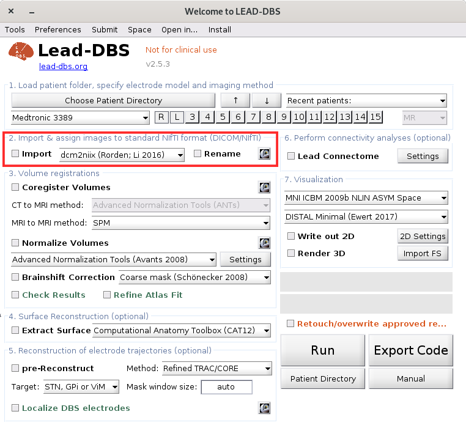
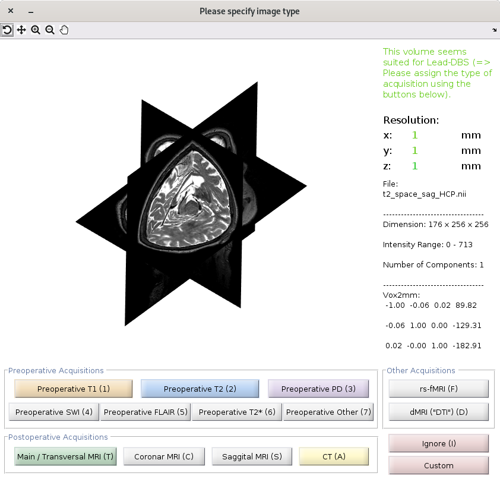

# 2. Image Import

Lead-DBS can process different image views. However, the image files must have a **specific name format** for them to be recognized. The naming scheme can be changed in the `ea_prefs.m` file within the LEAD installation directory. If you use the built-in DICOM import function, you are asked to specify the type of each acquisition within a GUI and thus don't have to do the naming manually.

### Import

You can start by selecting the patient folder containing the DICOM images and run the **Import** function. To further process data, images must be in the `*.nii` file format.

For instance, if your patient's ID is called `pat_001`, you would create a blank folder called `pat_001` and put all DICOM files into the folder `pat_001`. In Lead-DBS, simply select the folder `pat`001 to start and choose only the checkbox `Import DICOM` and/or assign NIfTI images and press run. Raw DICOM data will be moved into a subfolder (`pat001/DICOM`). Acquisitions will be converted to NIfTI format and for each sequence, you will be prompted by the GUI to assign it to a specific acquisition type. In these windows that will pop up, select e.g. whether the image shown to you is a pre- or postoperative MR image and/or of what type.

If you don't start with DICOM images but instead already have your files converted to NIfTI format, you can either assign the images with the same command, or simply rename each acquisition manually according to the next passage.

### Renaming and File Naming Format

Image files must follow a specific naming format. Use the **Rename** function and Lead-DBS shows previews of the images to help with renaming**.** You need to specify the type of image (e.g., MRI, CT, diffusion, preoperative, postoperative). **** You can run both **Import** and **Rename** in one go. Alternatively you can rename the images manually.

#### Preoperative images

`anat_t1.nii` / `anat_t2.nii` / `anat_pd.nii .`If you name your file `anat_t2.nii`, Lead-DBS assumes that it is a T2-weighted image. If you instead name it `anat_t1.nii`, it assumes that it is a T1-weighted image (`anat_pd.nii` for the rare case of proton density imaging). You can also use several (e.g. T2 and T1 weighted images) for combined normalizations using the ANTs multimodal normalization or all SPM based approaches.

`anat_*.nii` images . These could e.g. be special acquisitions that could help highlight the basal ganglia (like FGATIR/QSM or similar). These will be used as additional spectrums to segment grey from white matter in all SPM based normalization algorithms (i.e. SPM Segment, SPM DARTEL and SPM SHOOT).

`dti.nii`for diffusion MR images, `dti.bvec`for dti bvec table, `dti.bval`for dti bval table.

#### Postoperative images

Either you use MR imaging files with the following format: `postop_tra.nii` for transversal images, `postop_cor.nii` for coronal images and/ or `postop_sag.nii` for sagittal images.

Or you use CT imaging files with the following format:`postop_ct.nii`, if CT images have not been coregistered to the `anat.nii` file) or `rpostop_ct.nii` (if CT images have already been coregistered to the `anat.nii` file).

