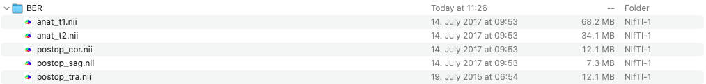

# Converting NIfTI-images into BIDS

| <h4 id="_toc95749082">Context</h4>                                                                                                                                                                                                                                                                                                                                                                                                |
| --------------------------------------------------------------------------------------------------------------------------------------------------------------------------------------------------------------------------------------------------------------------------------------------------------------------------------------------------------------------------------------------------------------------------------- |
| <ol><li>In the following steps, Lead DBS converts the legacy NIfTI-images into Brain Imaging Data Structure (BIDS) images.</li><li>BIDS is a data structure for neuroimaging and behavioural data used in the imaging domain.</li><li>This step is necessary to re-assure that the lead-DBS will be able to work with data. Moreover, using BIDS is an easy way to store and re-use the data between various toolboxes.</li></ol> |

| <h4 id="_toc95749083">Info panel</h4>                                                                                                                                                                                                                                                                                                                                                            |
| ------------------------------------------------------------------------------------------------------------------------------------------------------------------------------------------------------------------------------------------------------------------------------------------------------------------------------------------------------------------------------------------------ |
| <ol><li><strong>Make sure that one folder stores all of your patient data, that data are in NIfTI format, and the file names do not contain any spaces or special character</strong>s.</li><li>The folder should contain <strong>pre-operative anat files and post-operative postop files</strong>.</li><li>CT files cannot be used as pre-operative data, MRI files are used instead.</li></ol> |

Screenshot 1. Patient file - NIfTI

<figure><figcaption></figcaption></figure>

To start the importing process, simply select "Import NIfTI to BIDS dataset" and click "RUN".

<figure><figcaption></figcaption></figure>

#### &#x20;
