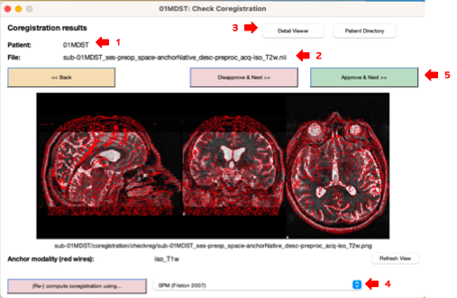
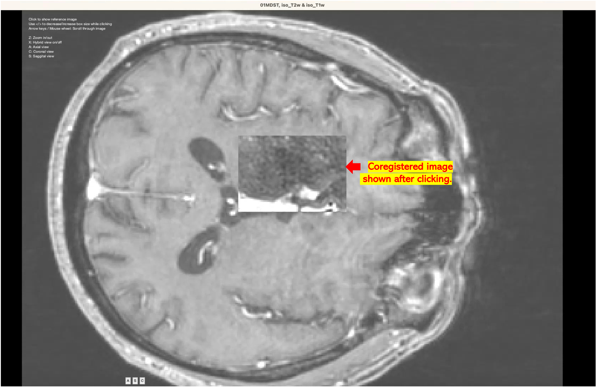
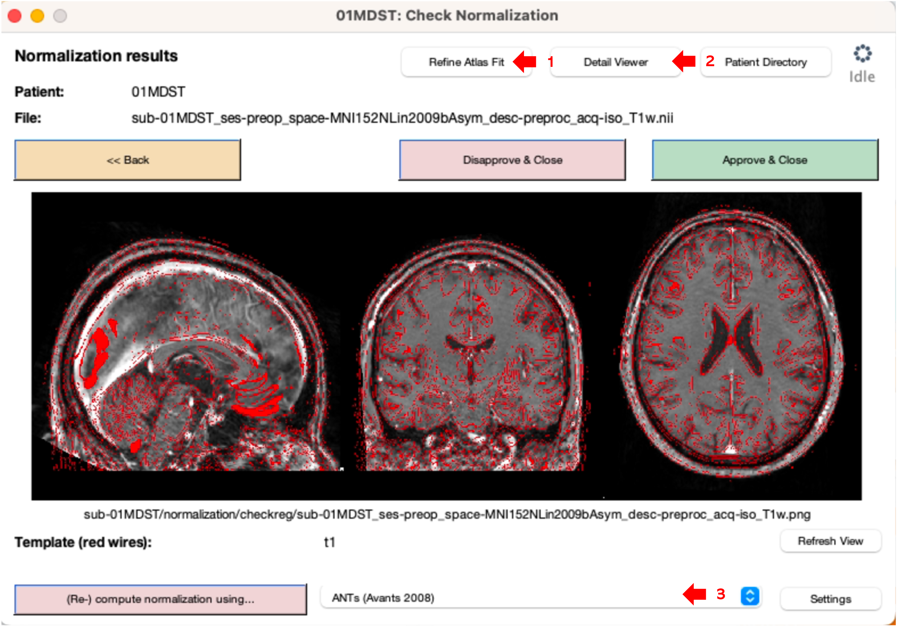
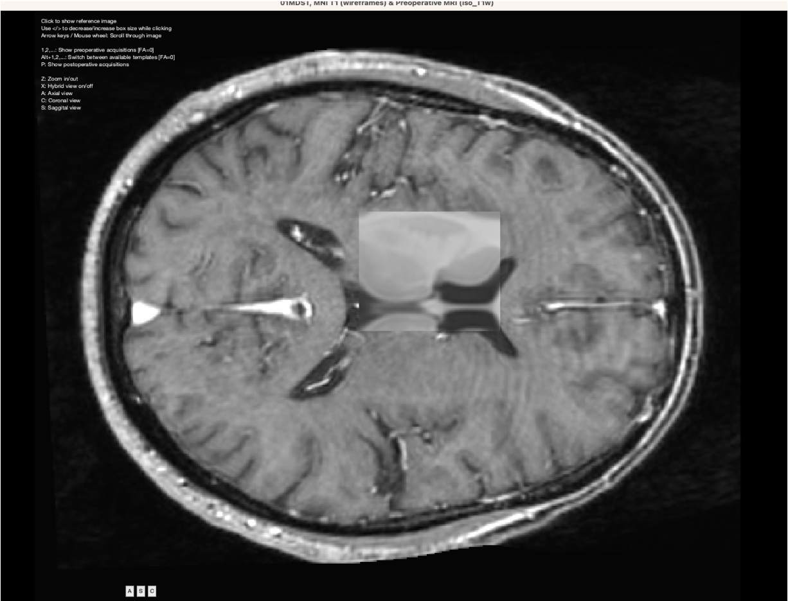

# Checking the Coregistration and Normalization

## Checking coregistration

### Context

1. _Lead runs the coregistration between pre-operative and post-operative images. Depending on the chosen normalization process, you will be shown the coregistration between different images and asked if they are precise enough for you to approve._&#x20;
2. _This process happens up to three times depending on the available image views. The order of coregistration is as follows:_
   * _Transversal to coronal view_
   * _Resulting image to sagittal view_
   * _Resulting image to pre-operative transversal view_
   * _Resulting image to the MNI space_

### How to

<figure><figcaption>
Image 1: Window with coregistration results.
</figcaption></figure>

1. When running coregistration, if the `Check Coregistration` the box is selected, a series of viewer windows (Image 1) called by the name of your patient (arrow 1) will appear.  These windows always show you the base file represented as red wires overlying the now coregistered image. Which image you are looking at is defined in the pathname displayed below the window with the images (arrow  2).

> Background: Lead generates screenshots of each coregistered image overlayed with the red wires of the basleine file to assess corregistration. These screenshots are stored under the `checkreg` folder.

2. &#x20;If you work with a postop CT, the window will show a tone-mapped image of your coregistered CT scan.
3.  You need to check the accuracy of coregistration:

    * Check the fit of the red wires to the base file.
    * Click on `Detail Viewer` (arrow 3). A new window (Image 2), where you can use the cursor to show the coregistered image overlaid over the baseline file will appear. On your keyboard, use `Z` to Zoom, `X` for Hybrid view and `A`, `C`, or `S` to change between axial, coronal and sagittal slices.
    * Your task here is to check whether the images properly overlay and that you do not observe any major differences between coregistered images.
    * You can also use Slicer for a more detailed investigation of coregistration accuracy, which is especially helpful to check post-operative CT coregistration accuracy.

    <figure><figcaption>
Image 2: Detail Viewer to assess quality of coregistration.
</figcaption></figure>
4. If you are happy with the results, you can close the detailed viewer (Image 2) and click on `Approve & Next` (Image 1, arrow 5). You can also re-run coregistration by changing one of the methods and clicking on `(Re-) compute coregistration using ...` (Image 1, arrow 4).

## Checking normalization

### Context

1. _It is very crucial to manually check the normalization quality of your images before starting the reconstruction process. No matter how you normalized your images, you can always set the `Check` checkbox below the `Normalization` checkbox to display slice images of your normalized images that are overlayed with a wire-frame structure that has been generated from the ICBM template._&#x20;
2. _Only if these results look very precise, i.e. you can see that the wire-frames from the template match the anatomy of the patient's normalized MR images, you should advance to the reconstruction step._

### How to

<figure><figcaption>
Image 3. Window with coregistration results.
</figcaption></figure>

1. A pop-up window with the normalization (just like for coregistration) will appear. Now, the red wires represent the MNI space whilst the underlying image is wrapped patient's image (Image 3).


Check the fit of red wires in the results view. Focus specifically on the DBS target regions (i.e., STN, GPi, ...).


2. You can click on Detail Viewer (arrow 2) again, to check normalization in more detail. The same window as when checking coregistration will appear (Image 4).
   * Click on the image, and drag the mouse around to check normalisation.&#x20;
   * Press `X` to see the hybrid view. Since the main area of interest is the DBS target, focus on the normalization of those structures. `A`, `C`, or `S` changes between axial, coronal and sagittal slices just like for coregistration.


If you need a more detailed investigation of the normalization, you can load the MNI template into the slicer and overlay it with normalized images.


3. If you are not happy with the fit, you can close the window and then click on `Refine Atlas Fit` (Image 3, arrow 1). A new window which allows you to check the normalization of specific structures for your patient will appear. It shows you STN, but also GPi, as well as other structures which you can choose. It allows you to also change the atlas from a list.&#x20;
4. If you are not happy with the normalization results, you can re-run normalization by clicking on `(Re-) compute coregistration using ...` (Image 3, arrow 3). You can also click on `Disapprove & Close` and re-run the whole analysis again with different settings. Also check our section on [refine-atlas-fit-with-warpdrive.md](refine-atlas-fit-with-warpdrive.md "mention"), which you can use to manually edit normalization results.

<figure><figcaption>
Image 4: Detail Viewer to assess quality ofnormalization.
</figcaption></figure>

3. If you are happy with the results, click on `Approve & Close`.&#x20;
