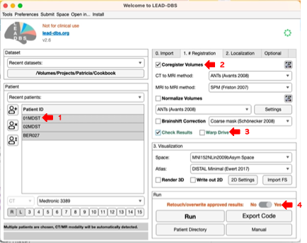

# Coregister Volumes

## Context

1. _Lead-DBS uses different implemented tools for coregistration. As a default, Lead-DBS chooses the SPM tools for coregistration between MRI images, whilst ANTs is used for coregistration between MRI and CT. This pre-defined setting is based on the Lead-DBS users' experience, and the user can change it at any time within the GUI. Lead offers to choose from a wide range of the most common coregistration methods in the field (i.e., SPM, ANTs, FSL and Brainsfit) as well as several customized ANTs pre-sets._
2. _Lead aligns all of the patient images to each other to ensure that they are in the same space and have the same resolution. During coregistration, images are shifted in space linearly, which means that all voxels in the same image keep the same relative distance to each other. Coregistration scales and skews the images but does not expand one region while shrinking the other._&#x20;
3. _Pre-operative T1-weighted MRI is defined by Lead-DBS as a base file. All the other images are then aligned into this base file. If T1 is unavailable, Lead-DBS chooses T2-weighted MRI images as a ground truth instead._
4. _In the first step, Lead-DBS checks the resolution of the base file. The resolution is sufficient if it is better than 1 mm on every axis.  A base resolution lower than 1 mm on any one axis will be upsampled to ensure maximal coregistration (and normalization) accuracy. During upsampling process, missing intensity values are generated by interpolating from the surrounding intensity values._
5. _If we have more than one pre-operative anatomical scan, Lead-DBS aligns them to the base file. Post-operative data are aligned after that._
6. _Coregistration is one of the crucial steps in electrode localization, and we must check its accuracy thoroughly._ Coregistration was successful when images seem completely aligned. We can check this using Lead-DBS, but additional viewing methods such as Slicer 3D can be used (https://www.slicer.org/).&#x20;

## How to

<figure><figcaption>
UI settings for coregistration.
</figcaption></figure>

1. Load your patient folder in BIDS format into Lead as described in [step1-load-patient-folder.md](../step1-load-patient-folder.md "mention").
2. Select the patient you want to register in the window on the left (arrow 1).
3. Select "<mark style="background-color:yellow;">**Coregistration Volumes**</mark>" and "<mark style="background-color:yellow;">**Check Results**</mark>," so you can see the output of coregistration (arrows 2 and 3).&#x20;
4. If coregistration has been run before, select "<mark style="background-color:yellow;">**Retouch/overwrite approved results**</mark>" (arrow 4) to get a new instance of coregistration results.
5. Press <mark style="background-color:yellow;">**Run**</mark>. The processing power of your computer determines the duration of coregistration step.&#x20;
6. To see how to check you results, consult [checking-the-coregistration.md](checking-the-coregistration.md "mention").

## Output

* A pop-up window with information about methods and references. If this information is not needed, the window can be closed.
* New coregistration data will appear in the selected file, under derivatives > leaddbs > patient\_name > coregistration.
