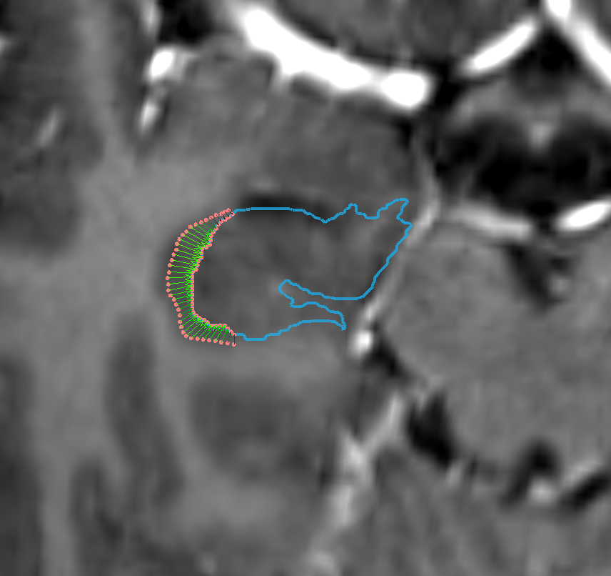

# Refine Atlas Fit with WarpDrive

This module takes a deformation field as an input and outputs an other deformation field which includes the user's manual modifications. This is adapted from Simon Oxenfords [readme page](https://github.com/netstim/SlicerNetstim/blob/master/WarpDrive/README.md).

### Limitations

* This module is under development and some usability improvements are being worked on (see [here](https://github.com/netstim/SlicerNetstim/issues/3)).&#x20;
* The input node selector only accepts Grid Transform nodes or Volume Nodes. [Grid Transforms are legacy](https://discourse.slicer.org/t/converttogridtransform-returns-vtkmrmltransformnode-instead-of-vtkmrmlgridtransformnode/18467) and used unfrequently throughout Slicer. SlicerANTs module uses it so works well (but only available in preview release). This behavior will change in future updates.
* When drawing using slicer preview release the preview line is not shown. This is because changes on Slicer codebase. Will need to update to match this usage.
* Use Axial, Sagital, Coronal views to manipulate (don't reformat with volume spacing --- this still needs work).
* Has been used mostly with normalizations to MNI space. Other grid orientation might run into issues (also work needed here).

### Tutorial

1. Load the MRHead from sample data and a [MNI T1 image](https://www.bic.mni.mcgill.ca/\~vfonov/icbm/2009/mni\_icbm152\_nlin\_sym\_09c\_nifti.zip).
2. Use a registration module (BRAINS, Elastix, ANTs) to normalize the MRHead to T1 space. Be sure to output a grid transform. Without hardening the transform, transform the MRHead with the result from normalization. (Preferably use ANTs that directly outputs grid transform node. If not, it might need to be converted.)
3. Switch to the WarpDrive module and set the output transform as the input node and create a new grid transform for the output.
4. Tools: there are a set of tools to input user modifications. In the end, these all will be creating a set of source and target fiducials that will appear under the corrections tab of the Data Control. It is useful to set the MRHead as foreground and MNI T1 as background images. Also useful to load model atlases (see the import atlas module).
5. If you have auto update on, then you will already be seeing the modifications done. Fiducials are used as an input to plastimatch software to compute the new deformation field. In the output tab some settings to plastimatch can be set.

**Notes** Every time the warp is calculated all source and target fiducials are used to compute it. The output can then be hardened in the transforms module to obtain one grid transformation from source to target.

