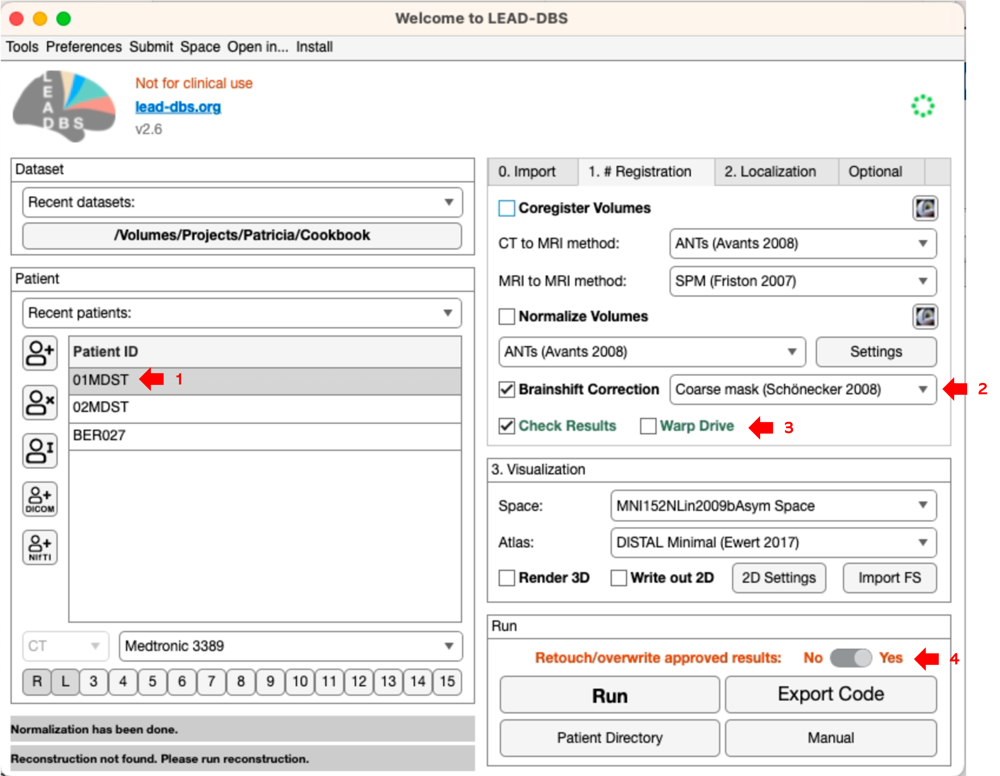

# Brainshift Correction

| **Context**                                                                                                                                                                                                                                                                                                                                                                                                                                                                                                                                                                                                                                                                                                                                                                                                                                                                                                                                                                                                                                                                                                                                                                                                                                                                                                                                                                                                                                                                                                                                                                                    |
| ---------------------------------------------------------------------------------------------------------------------------------------------------------------------------------------------------------------------------------------------------------------------------------------------------------------------------------------------------------------------------------------------------------------------------------------------------------------------------------------------------------------------------------------------------------------------------------------------------------------------------------------------------------------------------------------------------------------------------------------------------------------------------------------------------------------------------------------------------------------------------------------------------------------------------------------------------------------------------------------------------------------------------------------------------------------------------------------------------------------------------------------------------------------------------------------------------------------------------------------------------------------------------------------------------------------------------------------------------------------------------------------------------------------------------------------------------------------------------------------------------------------------------------------------------------------------------------------------- |
| <ul><li><em>This part of the processing pipeline is a tool to reduce bias introduced by brain shift. Brain shift happens when the skull is opened during surgery, it means that the brain (often nonlinearly) moves with respect to the skull, e.g. due to pneumocephalus (Image 1).</em></li><li><em>If you want to coregister the whole postop CT image to a preop MRI of the same patient, linear coregistration may result in a good match of the skull but a wrong coregistration of the brain, especially in frontal regions. Most often in DBS, we are interested in subcortical regions that could be seen as "remote enough" from the pneumocephalus. However, sometimes, there is no substantial brain shift or pneumocephalus to be found and it could be okay to not correct for this issue.</em></li><li><em>One common strategy in neuroimaging would be to use nonlinear deformations instead of linear transforms. However, in DBS, this is not possible since the electrodes in the postop image would be considered part of the tissue and could be nonlinearly moved within the brain. If this is not clear to you, think about why this is exactly what we do not want: Since we are interested in the relative location of the DBS electrodes with respect to other brain structures, we should never apply a nonlinear transform between postop and preop images.</em></li><li><em>A solution that may drastically reduce the bias introduced by brainshift is to use linear transforms but apply them to subcortical regions of interest only (Image 2).</em></li></ul> |

Technical background information

In theory, subcortical refines can be applied together with coarse refines "in one go". We used this strategy in earlier versions of Lead-DBS. However, the process was not robust enough and could not be implemented using all software available in Lead-DBS, in the same way. Furthermore and especially when dealing with postoperative CTs or significant electrode artifacts on MRI, many users sometimes manually apply a whole-brain coregistration in different software (such as [3D Slicer](http://slicer.org\)) if the options in Lead-DBS do not generate satisfactory results). That's why we chose to include this refine step at the very end of our pipeline. First ensure an as good as possible whole-brain coregistration and normalization then apply this subcortical refine step to the data.

We estimate the refine transform on interpolated and resliced data which is usually not the best approach. The process is _much_ more robust and universal this way. This practice allows us to support all the linear transform methods implemented in Lead-DBS (SPM, FSL, ANTs, BRAINSFit or hybrid solutions) in the same way. To account for the disadvantages of using coregistered and resliced data to estimate transforms, we apply the transform to non-discretized points in float format and use high resolution data throughout the whole pipeline.

The subcortical refine step uses ANTs and you don't have the option to choose from a multitude of software. This is due to the fact that any software would probably get these transforms right since images should already be pretty much aligned at this point. We use a layered transform composed of rigid, affine \[and mask1, mask2 if masks are used] stages in this final ANTs registration step.

As a side note:\
_This processing step was completely implemented into Lead-DBS during the_ [_2017 brainhack global event at MIT in Boston_](https://brainhack-boston.github.io)_._\
_Many thanks go out to the organizers of the event – as always @ brainhack, it was phenomenal._

###

### How to

<figure><figcaption>
Image 3. UI settings for brainshift correction.
</figcaption></figure>

1. To run brainshift correction, you first go through rough coregistration and normalization to template space. Select the patient (arrow 1), tick `Brainshift correction` with a mask, `Check Results` and press `Run`.
2. To estimate a transform, choose either `No Mask`, `Coarse Mask` or `Coarse + Fine Mask`. `No Mask` will just use the cropped images to estimate the transformation and is not recommended.  By choosing the `Coarse Mask`, a larger mask will be applied. If you choose to use both, `Coarse + Fine Mask.` The coarse mask (blue mask in the Schönecker publication within the [#context](subcortical-refine-post-to-pre-transforms.md#context "mention") panel) will be applied first, followed by the finer (yellow within the [#context](subcortical-refine-post-to-pre-transforms.md#context "mention") panel) mask.

In our example, let's see the use of the `Coarse Mask`. This will produce the following result:

3. As highlighted by the yellow arrows, some regions better overlap in this refined transform. The estimated transformation matrix is printed in the top right corner of the figure.
4. You can use a slice viewer (such as e.g. [3D Slicer](http://slicer.org\)) to further examine results in detail. The relevant files will be in derivatives/leaddbs/`patient folder/brainshift/anat.`
5. If you think the approach improved results, click `Approve & Close` to apply the transform to your DBS electrode reconstructions. If not, click `Disapprove & Close`. Alternatively, you can change the settings to `No Mask` or `Coarse + Fine Mask` and press `(Re-)compute coregistration using...` .

| **Output**                                                                                                                                                                                                                                                                                                                                                                                           |
| ---------------------------------------------------------------------------------------------------------------------------------------------------------------------------------------------------------------------------------------------------------------------------------------------------------------------------------------------------------------------------------------------------- |
| <ul><li>A pop-up window with information about methods and references. If this information is not needed, the window can be closed.</li><li>New normalization data will appear in the selected file, under <code>derivatives/leaddbs/patient_name/brainshift/</code>. <code>Anat</code> folder contains results, c<code>heckreg</code> folder stores the images as <code>.png</code> files</li></ul> |
