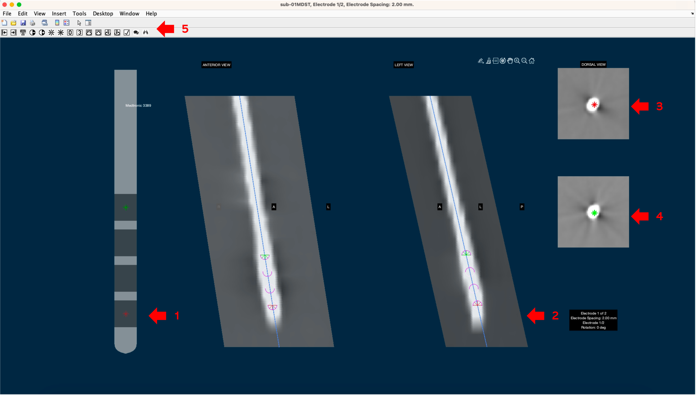

# 5. (optional) Reconstruction of Electrode Trajectories

## Context

1. _You are almost done! Once volumes are coregistered and optionally normalized, you can run `pre-reconstruct` of the electrode trajectories and `Localize DBS electrodes`, which is the actual electrode reconstruction step._

## How to

### 1. Pre-reconstruct electrode lead trajectories

1. For the automatic pre-reconstruction step to take place, check the`pre-Reconstruct` box (arrow 1). Choose the preferred parameters for obtaining the images, and press `Run`. Depending on the postop images, Lead-DBS selects a method automatically, i.e., Refined TRAC/CORE for postop MR and PaCER for postop CT.&#x20;
2. For more information on PaCER, read [Andreas Husch's site](https://adhusch.github.io/PaCER/stable/index.html).
3. For TRAC/CORE, Lead-DBS performs an automatic search of the artifacts caused by the electrode leads. This can be modified using the following parameters:
   * _Entry point:_ set `STN, GPi, or ViM`, `Cg25` or `Manual`. If set to _Manual_, you are prompted to select the starting point of the artifact for each side. The latter is important for troubleshooting but also if you try to reconstruct electrodes at uncommon DBS targets.
   * _Mask window size:_ either set a concrete value (the range of 5 to 20 might improve results) or set the value to “auto”. This option is only important for MR images, in CT imaging, a large mask size (e.g. 20) can be used but “auto” should work as well. If performing reconstructions based on MR images, please use a larger mask value if there is a lot of oedema around the electrode and a smaller value if the images are rather noisy. Smaller values will prevent the algorithm from “lose track” but might stop too soon if the artifacts are rather large.
   * For more information on TRAC/CORE, please consult [trac-core-details.md](trac-core-details.md "mention").

### 2. Localize DBS electrodes

1. The goal of this step is to **refine** the localization of the electrode and contact templates within the artifact, to place it as accurately as possible.
2. When the `Localize DBS electrodes` option is checked, Lead-DBS shows a window where you can visualize and modify the position and orientation of the electrodes. This should **always** be done to obtain a meaningful reconstruction. Moreover, this is probably the most difficult step in the standard processing pipeline of Lead-DBS, it needs some anatomical insight and experience with interpretation of postoperative images. We recommend watching[ the walkthrough tutorial](https://www.lead-dbs.org/helpsupport/knowledge-base/walkthrough-videos/) (around 00:40 minutes) to better understand this crucial processing step.
3. In this window, the user visualizes the position of the electrode trajectory with respect to the artifacts of the MR or CT images. On the left side, the illustration of the used electrode is shown (Image 2, arrow 1). Lead-DBS places within these artifacts the built-in templates for the electrodes, represented as straight lines that run along the artifacts (Image 2, arrow 2). The contacts are represented as a set of circles on the electrode lead lines (4 or 8 circles, depending on the electrode model chosen).&#x20;
   * First, the user adjusts the position of the right electrode, then the left electrode for a bilaterally implanted patient.

#### 2.1 Adjusting Electrode Depth and Contact Position

1. If no contact is selected, the up and down **arrow keys** move the _whole_ electrode up or down in the axial plane. Pressing `Shift` together with the arrow keys moves the electrode in bigger steps.
2. For easier adjustment, specific contacts can be selected and their changes checked in their respective transversal views. Contacts are selected by clicking on the little `0` or `3` icon in the menu bar or by pressing `0` or `3` on the keyboard.
   * pressing `0` selects lower contact (Image 2, arrow 5).
   * pressing `3` selects upper contact (Image 2, arrow 4).
3. With a specific contact the arrow keys up, down, left and right adjust the position within the axial and coronal planes. The goal is to center the trajectory on the artifact (white in the CT image above).
4. In the upper left corner, you can see the buttons which work the same way as the arrows and the keyboard commands with some additional functions (Image 2, arrow 5). If you move the cursor around and point at one of them, a short text explaining their function will appear.
5. To detect the orientation of directional leads such as Boston Vercise Directional, see [the subpages](determining-the-orientation-of-directional-leads/) by Till Dembek.
6. To save the adjustments and move to the next electrode, press the `SPACE` bar. To read more about how these reconstructions are stored, open this subpage.
