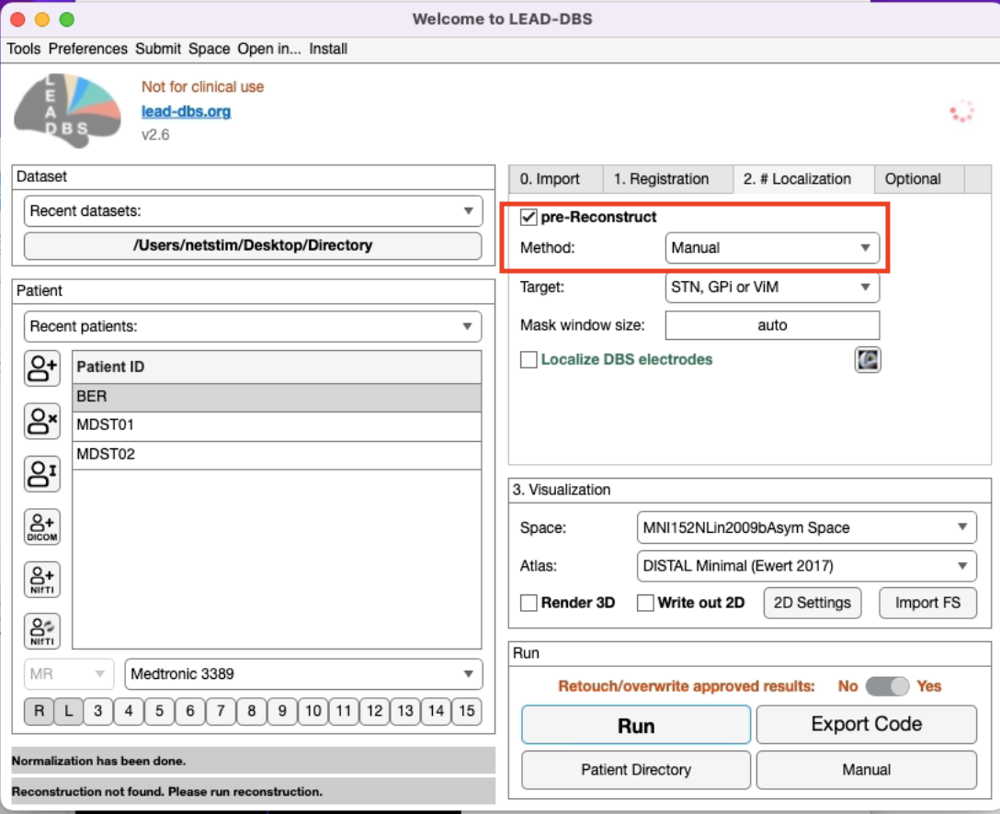

# Manual Reconstruction

If you have problems with PACER or TRAC/CORE, it is also possible to pre-reconstruct using the manual reconstruction option. For this, select Pre-reconstruct from the Reconstruction pane, choose "Manual" as the method and press run.

<figure><figcaption></figcaption></figure>

&#x20;

1\) 2 SPM windows will pop up, one with the images and one with the next steps. If you want, you can adjust the contract in this stage.

2\) Start with selecting the right hand side electrode first. Be careful, this is not he right side of the patient, but **your right side.** Move the cursor around to place the intersection of the two blue sides to the tip of the electrode in all axes. It is possible to zoom in and out using the toolbar. When you're happy with your selection, click OK in the other window.&#x20;

\

3. Then select a point in the trajectory, again of the electrode **to your right side.** When you're happy with your selection, click OK.

<figure><figcaption></figcaption></figure>

4. Repeat with the other electrode and you're done!
5. Continue with "Localize DBS Electrodes" to fine tune the electrode localization. (explained in the page:[.](./ "mention") )
