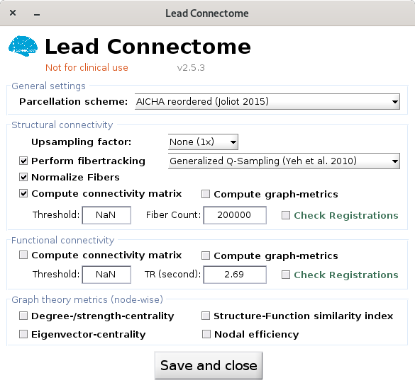

# 6. (optional) Perform Connectivity Analysis

This requires patient-specific diffusion and/ or functional MR images and allows fibertracking and connectivity analyses. See the [walkthrough tutorial](https://www.lead-dbs.org/helpsupport/knowledge-base/walkthrough-videos/) for details (around 01:05 hours).

If you like to use normative structural or functional connectomes, run the app [Lead Connectome Mapper](../connectomics/lead-mapper.md) or check the [Connectomics](../connectomics/connectomic-analyses/) pages.

