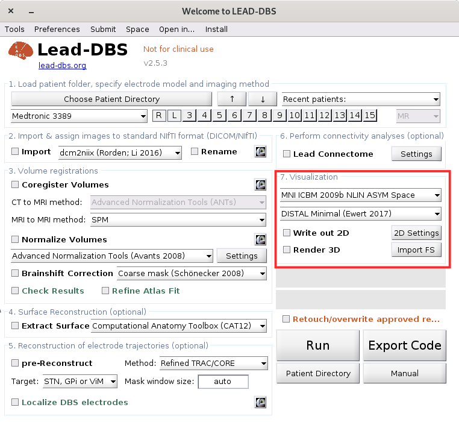
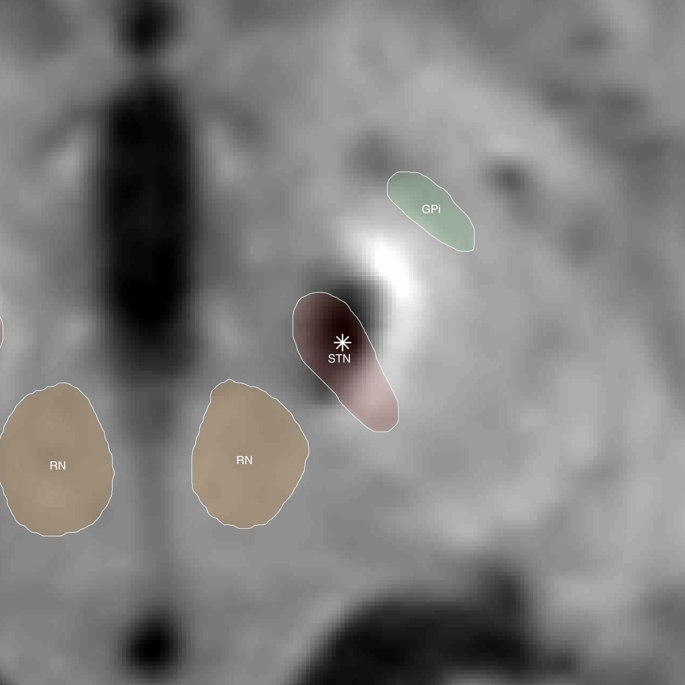
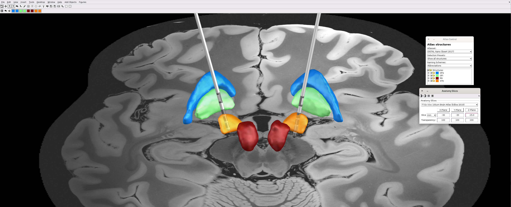
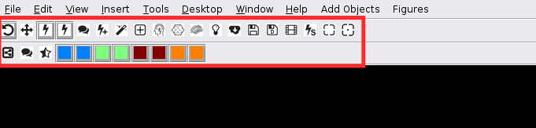

# 7. Visualization

### Rendering 2D Images

After a successful reconstruction, you can obtain 2D images of each contact at its location. To select this option, the box `[] Write out 2D` must be checked within the Lead-DBS main window.

The 2D images are based on the localization obtained during the reconstruction and the manual correction. They help to better understand how the electrode contacts relate to the surrounding brain structures.

Certain features can be changed to enhance the understanding of the structures surrounding the contacts:

* _Labels and colors_: Specific brain areas are labeled and colored for easier identification. The labels can be turned off or on by checking the `Label` box. The color of the contour can also be selected from a pop-up window.
* _Bounding box_: Determines the final size of the 2D image.

Images are stored as `.png` files within the patient folder, and are named according to the electrode and the plane they belong.

### Rendering the 3D Scene

If you set the `Render 3D` button in the Lead DBS main window and press the Run button, the Lead 3D viewer pops up and renders the reconstructed electrodes and the atlas components in the main window. This figure can be rotated in 3D using the built-in MATLAB 3D rotation tool and atlas components can be hidden (and shown back again) by pressing the corresponding colored check boxes in the secondary toolbar of the viewer (press the `alt`-key to hide/show all atlases of the set – this only works if no other tool, such as the MATLAB 3D rotation tool is selected).

In the 3D viewer, there are various icons in the tool strip. You can set:

* `Show Electrode`: For each electrode shown, there is a toggle button with which you can show or hide it. If no other tool is active (e.g. the MATLAB 3D rotation tool), you can additionally press the `alt`-button to show/hide all electrodes at once. This is helpful when visualizing groups of patients in Lead Group.
* `Electrode labels`: Shows/hides the patient names at the top of each electrode displayed. This is especially helpful when visualizing groups of patients in Lead Group.
* `Add trajectory`: To add a trajectory to simulate, for instance, surgery.
* `Stimulation Control Figure`: This button opens the stimulation settings window. Using this window, you can estimate VTAs.&#x20;
* `Slice Control Figure`: Opens the anatomy control figure which can be used to add x-, y- and z-slices of an MR image to the scene. You can choose to visualize the MNI template, the pre-/post-op MR images of the current patient or a different image. This control figure can also be used to only show a 2D-like slice of the current scene in x-, y- or z-axis.
* `MER Control Figure`: Perform [MER analysis](mer-analysis.md) if you have microelectrode recordings. Helpful for instance to note entry and exit of the subthalamic nucleus.
* `Connectivity Visualization`: To perform connectivity analysis with, for instance, a VTA seed.
* `Cortical Reconstruction Visualization`: Displays the cortex.
* Different options to set lighting, save screenshots or set the default view.
* `Save video`: Use this button to export a video of the current scene. This is done based on preferences set in `ea_prefs.m`.
* The colored squares denote atlas components or added objects. You can add objects such as ROI, tracts either through drag and drop or 'Add Objects' in the menu bar.
