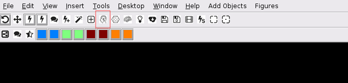
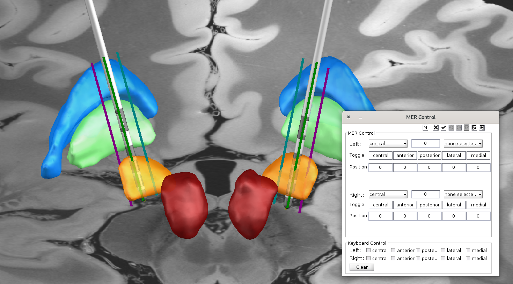

# MER Analysis

Start the MER Control Figure inside the 3D viewer.

1. Choose the implanted tract from the dropdown menu near`Right`or`Left`
2. Toggle the implanted tracks on and off`Central, Anterior, Posterior, Lateral, Medial`.
3. Change the location of the MER site by entering the position in the edit box or by using the arrow keys to change the position along the track. Hold`Shift` to increase step size. Hold`option`to decrease step size. Note: Choose a toggle button for the electrode of interest.
4. Mark a recording site using keyboard shortcuts. Reserved keys are:
   * `spacebar = "generic"`
   * `m = "MER"`
   * `l = "LFP"`
   * `t = "Top"`
   * `b = "Bottom"`
5. Use the`export markers`button in the MER Control GUI to save markers as a`.mat`file.
