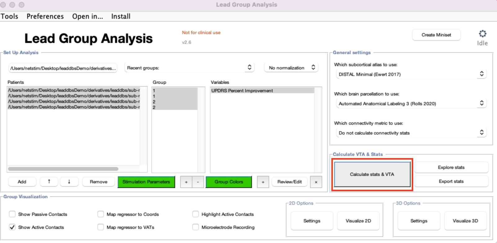

# Calculate VTA and Stats

To Calculate stats and VTA, click "Calculate stats & VTA" in the main GUI.&#x20;

<figure><figcaption></figcaption></figure>

This will calculate the VTAs and electrical fields for both hemispheres for each patient, in native and in MNI space. The generated files will be stored under "stimulations" folder of each patient. An example of the folder structure is displayed below:

<figure><figcaption></figcaption></figure>

