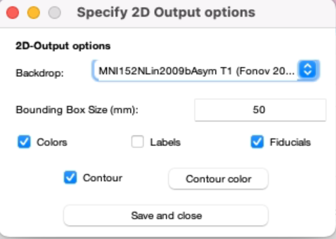

# Group Visualization

### 1) 2D Visualization of Electrodes as Point Clouds colored by Group

.png>)Example Image of 2D visualization by group.

<figure><figcaption>
Figure 1a
</figcaption></figure>

1.1. In the main Lead Group GUI, select all the patients you want to visualize.

1.2. In the visualization options, select “show active contacts” (additionally “show passive contacts”, if preferred)

1.3. Under 2D options – Settings, you can adjust the backdrop from the dropdown menu. (Figure 1b) Try 7T Ex vivo 100um Brain Atlas (Edlow et al., 2019). Save and close.

1.4. Press Visualize 2D.

### 2) 3D visualization

2.1. Select all the patients you want to visualize.

2.2. Click "Settings" under "3D Options". Here you can find options for electrode rendering. It is possible to visualize point clouds and solid or transparent electrodes. An example of each is given at the end of this section. Click "Save".

<figure><figcaption></figcaption></figure>

2.3. Click "Visualize 3D." 3 new windows will pop up: Electrode scene, atlas settings and anatomy slices. From anatomy slices window, you can select the backdrop of your choice and adjust slice position. From atlas settings, you can choose which atlas structures to display. From the electrode scene window you can adjust the camera angle, lighting of the scene and colors of individual atlas structures.

#### 3D Visualization Examples

**Point clouds.** Groups are represented by different colors. GPe is shown blue, STN and GPi are displayed in gray.

**Transparent electrodes with "Highlight Active Contacts" option.**

**Solid electrodes.**

### 3) Clinical Regressors

Figure 4: Clinical regressors For Figure 4, the two outputs from figures 5C and 5D were imported in 3D slicer and overlaid on the 7T Template. Color bars in figures 4 and 5 were added manually, but can be plotted by: ea\_plot\_colorbar(cmap, \[], 'h', '', \[1,length(cmap)], {num2str(min(M.isomatrix{1}), '%.2f'),num2str(max(M.isomatrix{1}), '%.2f')}) 6. Figure 5A: Point Clouds, colored by regressor Same as Figure 3 left but check the box “color by regressor” in the 3D options. This box can only be checked if Point-Clouds are selected. 7. Figure 5B: map regressor as interpolated point mesh a. Under Visualization Options check the box “Map regressor to Coords” b. Uncheck the box “Show Active Contacts” c. In 3D options, same as for previous figure and select “Visualize regressor as: Interpolated point mesh” 8. Figure 5C: regressor mapped as isosurface a. Same as previous figure, but select “Visualize regressor as: isosurface” b. In the group folder you can then find the resulting surfaces as nifti files (used for figure 4), named after the regressor and one for each hemisphere Preferences for colormaps can be edited in the 3D settings! 9. Figure 5D: Map regressor to VAT a. Under Visualization Options, instead of “Map regressor to Coords”, select “Map regressor to VAT” b. Together with the plot, a window appears, which allows to change the threshold, alpha and smoothing of the regressor c. The following output, provided for the left hemisphere (right electrodes are mirrored to the left side), can be found in the group folder under statvat\_results-models:

* N image: values indicate the sum of VTAs in each voxel
* Mean image
* Median image
* T image: sum of T-values from one-sample t-tests (sum of clinical regressor vs. 0) Plus thresholded versions of the same named \_nthresh: in ea\_writeMvat, a threshold can be defined (default 0.1) as the percentage of the maximum N.
