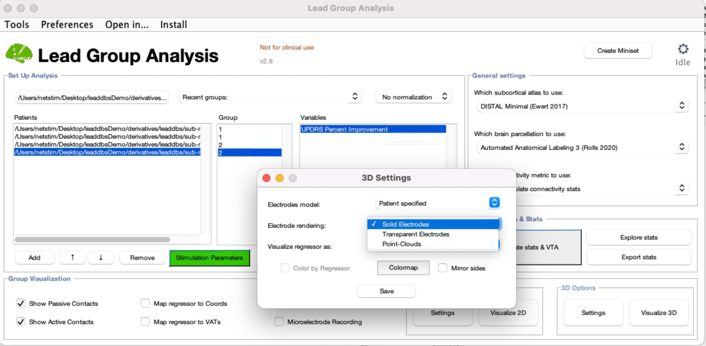

# Group Visualization

The original tutorial can be found [here.](https://ars.els-cdn.com/content/image/1-s2.0-S1053811920305048-mmc1.pdf)

### 1) 2D Visualization of Electrodes as Point Clouds colored by Group

.png>)Example Image of 2D visualization by group. Adapted from S. Treu et al., 2020.

<figure><figcaption>
Figure 1a
</figcaption></figure>

1.1. In the main Lead Group GUI, select all the patients you want to visualize.

1.2. In the visualization options, select “show active contacts” (additionally “show passive contacts”, if preferred)

1.3. Under 2D options – Settings, you can adjust the backdrop from the dropdown menu. (Figure 1b) Try 7T Ex vivo 100um Brain Atlas (Edlow et al., 2019). Save and close.

1.4. Press Visualize 2D.

***

### 2) 3D visualization

2.1. Select all the patients you want to visualize.

2.2. Click "Settings" under "3D Options". Here you can find options for electrode rendering. It is possible to visualize point clouds and solid or transparent electrodes. An example of each is given [at the end of this section](group-visualization.md#3d-visualization-examples). Click "Save".

<figure><figcaption></figcaption></figure>

2.3. Click "Visualize 3D." 3 new windows will pop up: Electrode scene, atlas settings and anatomy slices. From anatomy slices window, you can select the backdrop of your choice and adjust slice position. From atlas settings, you can choose which atlas structures to display. From the electrode scene window you can adjust the camera angle, lighting of the scene and colors of individual atlas structures.

#### 3D Visualization Examples

**Point clouds.** Groups are represented by different colors. GPe is shown blue, STN and GPi are displayed in gray.

**Transparent electrodes with "Highlight Active Contacts" option.**

**Solid electrodes.**

***

### 3) Clinical Regressors

#### 3.1. Point Clouds, colored by regressor&#x20;

.png>)3.1. Active contacts colored by regressor intensity.

* Check the box “color by regressor” in the 3D options. This box can only be checked if Point-Clouds are selected.

#### 3.2. Map regressor as interpolated point mesh&#x20;

.png>)

Fig. 3.2. The regressor mapped to an equidistant point grid after solving a scattered interpolant based on the original values and active coordinates.

* Under 3D Visualization Settings check the box “Map regressor to Coords”
* Uncheck the box “Show Active Contacts”&#x20;
* In 3D options, select “Visualize regressor as: Interpolated point mesh”&#x20;

#### 3.3. Map regressor as isosurface

.png>)

Fig. 3.3. The equidistant grid in the previous step can be thresholded and visualized as a 3D surface.

* Select “Visualize regressor as: isosurface”
* In the group folder you can then find the resulting surfaces as nifti files, named after the regressor and one for each hemisphere.&#x20;
* Preferences for colormaps can be edited in the 3D settings!&#x20;

9\. Figure 5D: Map regressor to VAT a. Under Visualization Options, instead of “Map regressor to Coords”, select “Map regressor to VAT” b. Together with the plot, a window appears, which allows to change the threshold, alpha and smoothing of the regressor c. The following output, provided for the left hemisphere (right electrodes are mirrored to the left side), can be found in the group folder under statvat\_results-models:

* N image: values indicate the sum of VTAs in each voxel
* Mean image
* Median image
* T image: sum of T-values from one-sample t-tests (sum of clinical regressor vs. 0) Plus thresholded versions of the same named \_nthresh: in ea\_writeMvat, a threshold can be defined (default 0.1) as the percentage of the maximum N.

"First, most simply, all active contacts were visualized as a point cloud and colored by the variable intensity (section S1.6 in the walkthrough tutorial). Second, the improvement variable was mapped to an equidistant point grid after solving a scattered interpolant based on the original values and active coordinates (section S1.7). Third, this equidistant grid was visualized as an isovolume, i.e. the grid was thresholded and visualized as a 3D-surface (section S1.8). These first three options mapped clinical improvement to the active contact coordinates. A fourth option is available that instead mapped these values to VTAs (section S1.9). Here, each binary VTA was weighted by its corresponding improvement value and, for each voxel, a T-value was estimated. The resulting volume was thresholded based on visual inspection at an arbitrary T-value (10.56). This value was visually chosen to obtain a “sweet-spot” with small anatomical extent."

## References

* Treu, Svenja, Bryan Strange, Simon Oxenford, Wolf-Julian Neumann, Andrea Kühn, Ningfei Li, and Andreas Horn. “Deep Brain Stimulation: Imaging on a Group Level.” NeuroImage 219 (October 1, 2020): 117018. https://doi.org/10.1016/j.neuroimage.2020.117018.
