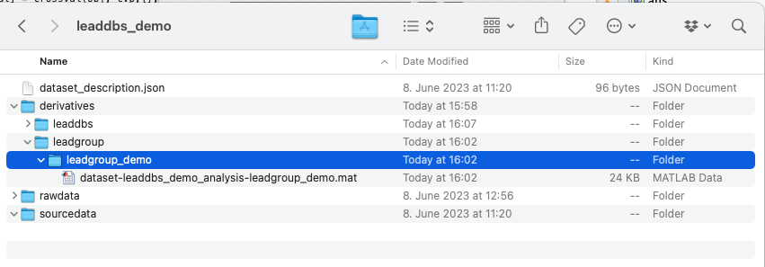

# Setup Analysis

After you open Lead-Group by typing `lead group` in MATLAB, here are the steps you should follow to set up your group analysis:

<figure><figcaption>
Fig. 1
</figcaption></figure>

**1)** Specify your directory by clicking "Choose Dataset Directory." This should be the folder that contains your derivatives, source and raw folders. (fig. 1)

**2)** Name your group analysis in the window that pops up. (fig. 1) This process creates a .mat file inside your derivatives/leadgroup/groupanalysisID folder that will store the group information including the stimulation parameters and regressors. (fig. 2)

<figure><figcaption>
Fig. 2: Folder organization for Lead Group files
</figcaption></figure>

**3)** Click "Add" in the main Lead DBS GUI to start adding patients. (fig. 1) A window will pop up that allows patient selection. (fig.3) You can choose all or a subset of patient folders to add to your group analysis.&#x20;

<figure><figcaption>
Fig. 3: Patient selection
</figcaption></figure>

**4)** To enter stimulation parameters, choose the patient you want to work on and click on the "Stimulation Parameters" button in the main GUI. (fig. 4)

**4.1)** From the dropdown menu, select the VTA model that you want to use. You can click on "Settings" button to edit the default conductivity and e-field threshold levels. (fig. 4)

**4.2)** Enter the stimulation amplitude in the yellow box. From the dropdown menu, it is possible to select voltage (V) or current (mA). (fig. 4)

**4.3)** Select the active contacts. (fig. 4)

**4.4)** You can move between patients using "Previous" and "Next Patient" buttons.&#x20;

**4.5)** After entering the parameters, click "Save."&#x20;

<figure><figcaption>
Figure 4: Entering the stimulation settings
</figcaption></figure>

5\)&#x20;
