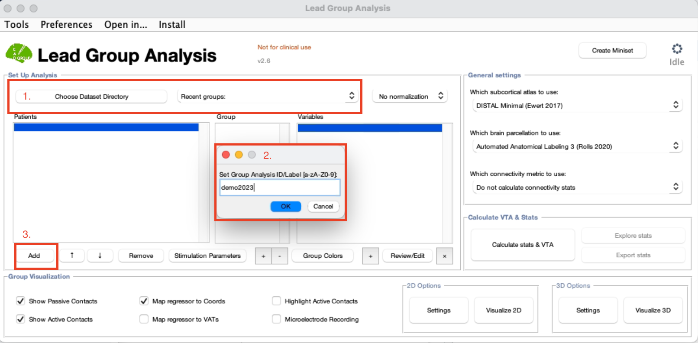
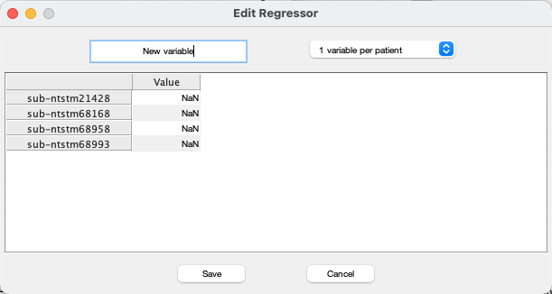
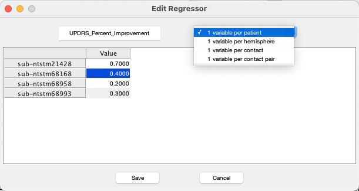
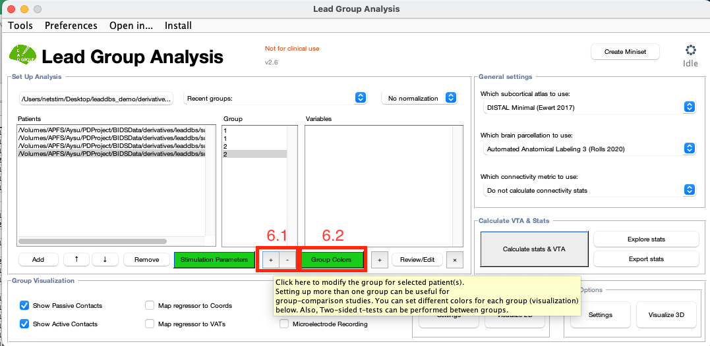

# Setup Analysis

After you open Lead-Group by typing `lead group` in MATLAB, here are the steps you should follow to set up your group analysis:

<figure><figcaption>
Fig. 1
</figcaption></figure>

**1)** Specify your directory by clicking "Choose Dataset Directory." This should be the folder that contains your derivatives, source and raw folders. (fig. 1)

**2)** Name your group analysis in the window that pops up. (fig. 1) This process creates a .mat file inside your derivatives/leadgroup/groupanalysisID folder that will store the group information including the stimulation parameters and regressors. (fig. 2)


**The name of your group analysis should contain only letters and numbers. Dashes and other characters are not supported!**


<figure><figcaption>
Fig. 2: Folder organization.
</figcaption></figure>

**3)** Click "Add" in the main Lead DBS GUI to start adding patients. (fig. 1) A window will pop up that allows patient selection. (fig.3) You can choose all or a subset of patient folders to add to your group analysis.&#x20;

<figure><figcaption>
Fig. 3: Patient selection
</figcaption></figure>

**4)** To enter stimulation parameters, choose the patient you want to work on and click on the "Stimulation Parameters" button in the main GUI. (fig. 4)

**4.1)** From the dropdown menu, select the VTA model that you want to use. You can click on "Settings" button to edit the default conductivity and e-field threshold levels. (fig. 4)

**4.2)** Enter the stimulation amplitude in the yellow box. From the dropdown menu, it is possible to select voltage (V) or current (mA). (fig. 4)

**4.3)** Select the active contacts. (fig. 4)

**4.4)** You can move between patients using "Previous" and "Next Patient" buttons.&#x20;

**4.5)** After entering the parameters, click "Save."&#x20;

<figure><figcaption>
Figure 4: Entering the stimulation settings
</figcaption></figure>

**5)** Next step is to add your variables of interest. To add a regressor, click the "+" sign below the Variables column. (fig 5.1) A window will pop up that allows you to enter the regressor for each patient and assign a name for this variable. (fig. 5.4) The default is 1 variable per patient. If your variables are per hemisphere, per contact or per contact pair, you can use the dropdown menu and select the suitable option. (fig. 5.5) If you need to change anything, you can click on "Review/Edit." (fig 5.2) Same window will pop up and it is possible to edit the titles and subscores. If you want to remove a variable, simply click on the "x" button. (fig 5.3) It is possible to add multiple variables. If you want to add another variable, repeat this process.

Note: alternatively, variables can be added more easily within Matlab, in the Lead group file “M.clinical.vars”, which can be found in the group folder after creating a new group.

<figure><figcaption>
Figure 5: Adding variables
</figcaption></figure>

<figure><figcaption>
Fig. 5.4
</figcaption></figure>

 

<figure><figcaption>
Fig. 5.5
</figcaption></figure>

6\) You can assign groups to patients. Select the patient and assign a group number by using the "+" and "-" buttons under the Group column. (fig. 6.1) It is possible to select multiple patients at once and change the group at the same time. It is possible to assign colors to each group by clicking "Group Colors." (6.2) This will later be helpful for better visualization.

<figure><figcaption></figcaption></figure>

Your Lead Group file is now set up! All the information you entered will be saved in the `.mat` file under your leadgroup folder.
