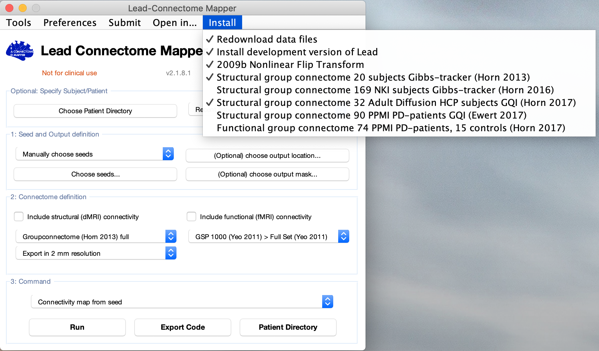
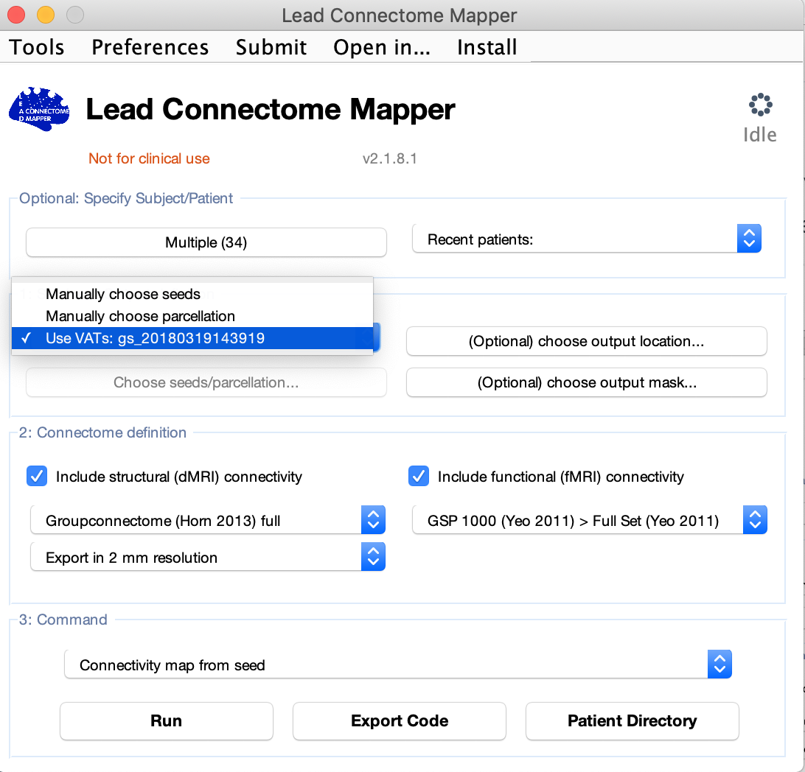
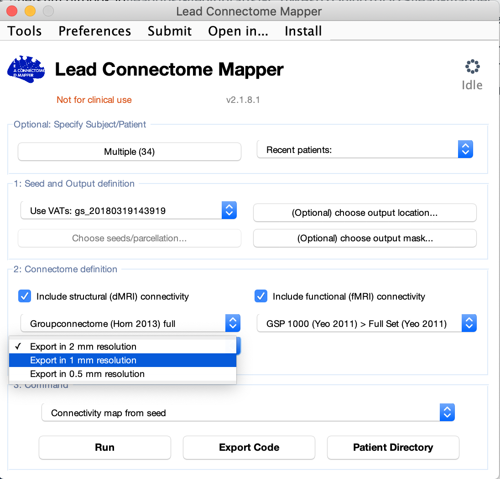
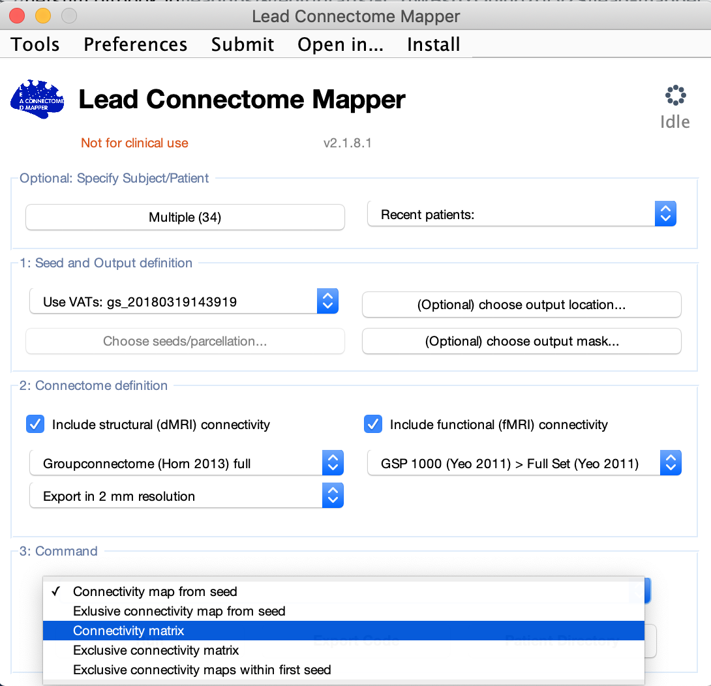
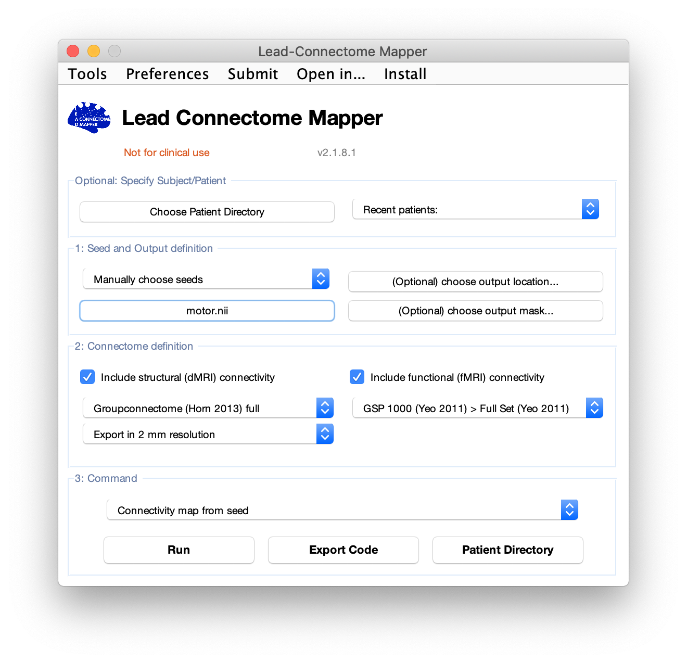
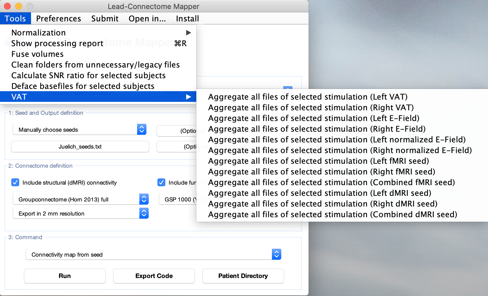

# Lead Mapper

Lead mapper provides a platform to build seed-based connectivity \(structural and functional\) from VTAs to whole brain. Connectivity maps can be built using functional and/or structural connectome. There are multiple options for a connectome to select from. Any of these options can be downloaded using the 'install' drop down menu from LEAD mapper.

If you would like to run VTAs based connectivity, then choose patient folders containing VTAs models calculated with LEAD group and drag them to 'Choose Patient Directory' panel. Go to 'Manually choose seeds' and change it to the folder name that appear automatically after selecting patient folders. This will allow LEAD mapper to access the folder containing VTAs files in each patient. 

You can opt to perform Structural, functional or both connectivity by ticking the box next to each modality in the 'Connectome definition' panel. For structural connectivity, you can further define the resolution of the connectivity map \(2, 1 or 0.5 mm resolution\).

The command panel allow you to select whether to extract connectivity maps \(nifti images\) or connectivity matrices. 

Another functionality of the mapper tool in LEAD dbs can be exemplified in using it outside the context of DBS realm. One can run seed-based connectivity by defining a brain seed other than VTAs and using the connectome options available in LEAD dbs. In this case, LEAD mapper will calculate the selected connectivity from this seed to the whole brain in the same manner as it is for VTAs. Imagine that we want to calculate connectivity from motor cortex which we define from a parcellation atlas of the brain and prepare as nifti image. This can be fed to LEAD mapper by choosing the seed manually.

You can run multiple seeds to whole-brain connectivity by choosing a text file you prepared with text editor containing the path to the seeds in your computer

Another useful utility in ELAD mapper, which resides in the Tools menue, is the VAT tool which let you aggregate VATs nifti files from selected patients folders to specific place. You can aggregate VATs according to side of the brain or as combined bilateral VAT images. This will basically copy the VAT mask files to the specified folder you select in addition to a text file containing a list of VATs path. Another feature is to select among structural or functional VAT and whether you want to extract the E-field of the VAT binary mask nifti images.

