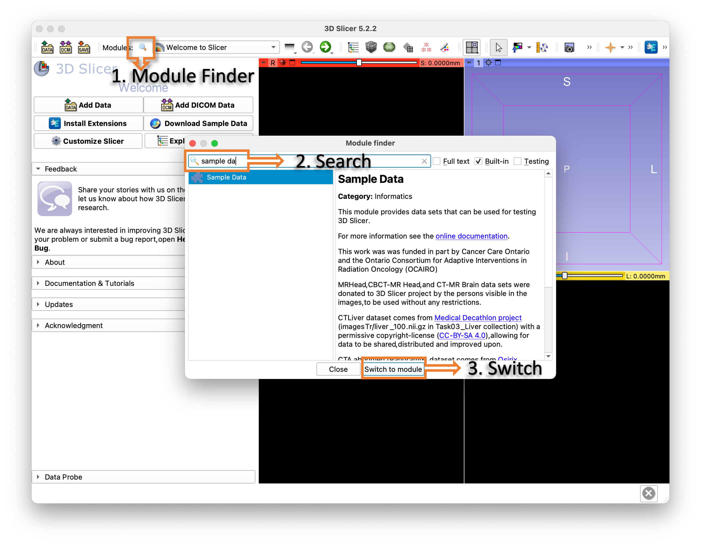
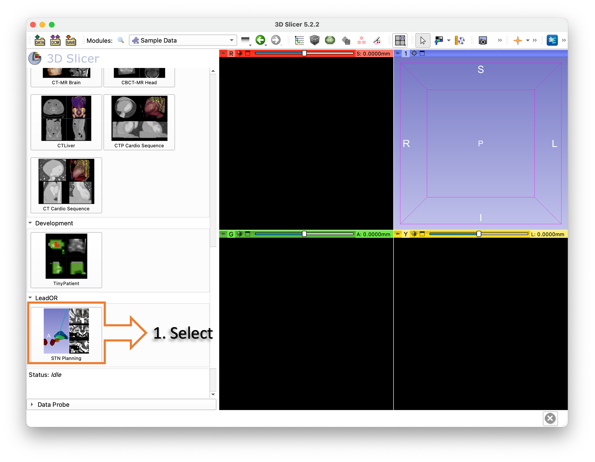

# Imaging setup

## Requirements

1. **3D Slicer:** [3D Slicer](https://download.slicer.org/) (v >= 5.2.2) together with the SlicerNetstim, SlicerOpenIGTLink and SlicerIGT extensions should be installed.
2. **ORScene:** An _ORScene_ is a file that includes subject images, planning information and atlas-based segmentations ready to loaded into Slicer. It can be created from Lead-DBS and an example dataset is already included in the SlicerNetstim extension.

## Loading sample ORScene

A sample ORScene is included to test the platform. To load it follow the next steps:

1. Open Slicer.
2. Switch to Sample Data module.
3. Scroll down and select STN Planning.

See the following screenshots as reference:

<figure><figcaption>
Step 2: Switch to Sample Data module.
</figcaption></figure>

<figure><figcaption>
Step 3: Select STN Planning ORScene.
</figcaption></figure>

## Creating new ORScene

In order to create an ORScene __ follow the next steps:

1. Process a subject in Lead-DBS with the **co-registration** and **normalization** steps.
2. Place the surgical planning files under a `leador` subfolder within the subject folder.
3. Load the subject in Lead-DBS and select `Tools > Lead-OR > Create ORScene`. Note that the selected atlas will be put into the scene as well.
4. Drag and drop the `ORScene.mrb` file into Slicer.

See the following screenshots as reference.

<figure><figcaption>
Step 2: Lead-DBS subject processed and with Brainlab planning files in respective folder.
</figcaption></figure>

<figure><figcaption>
Step 3: Create ORScene from Lead-DBS.
</figcaption></figure>

<figure><figcaption>
Step 4: Output folder with file to load into Slicer.
</figcaption></figure>
