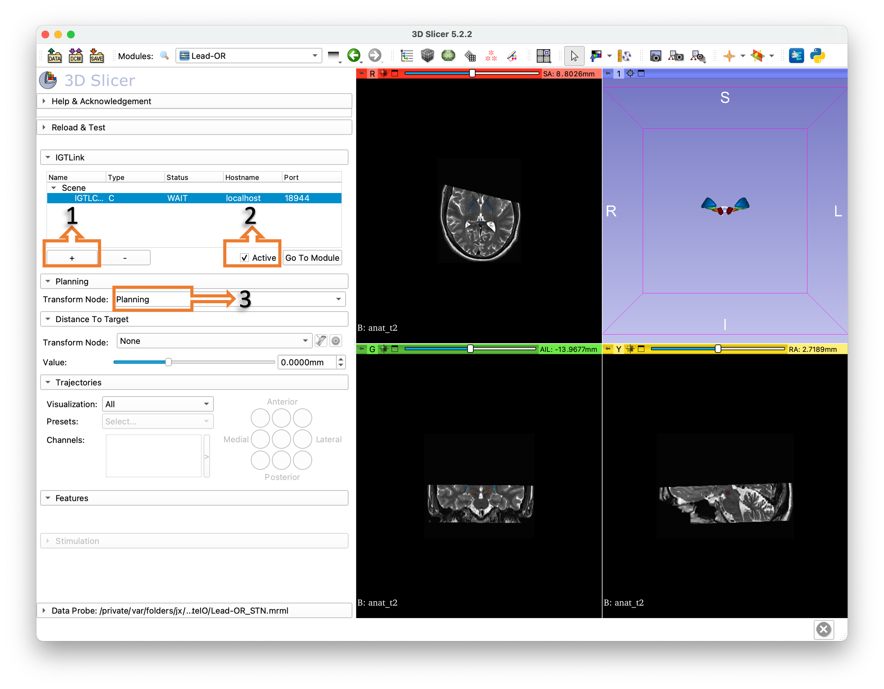
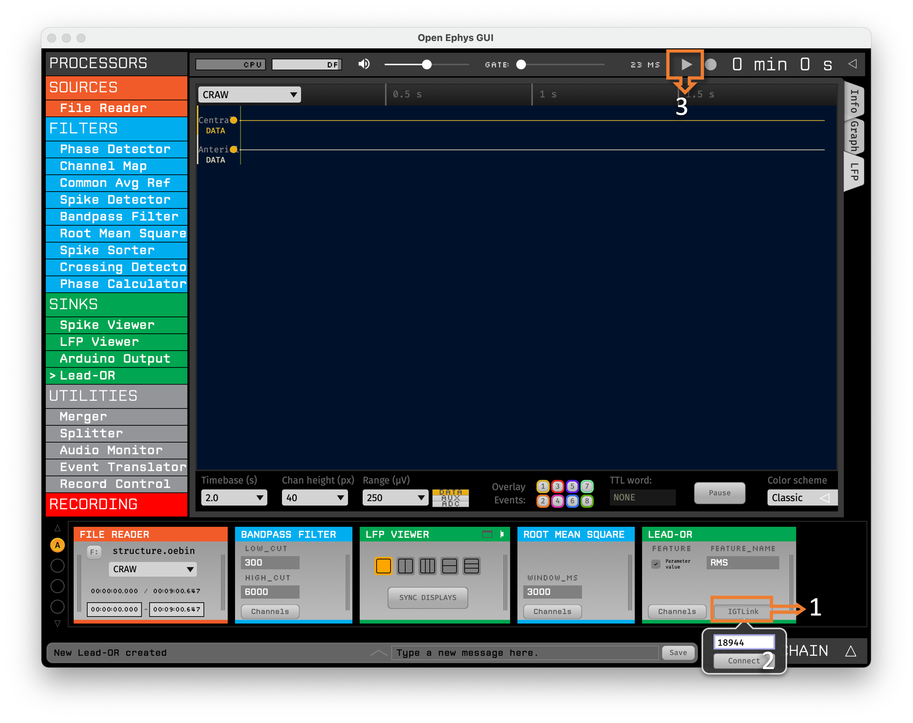
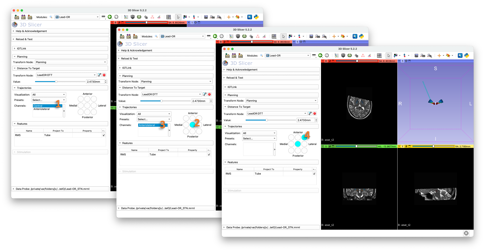

# Using the platform

This page shows an overview of the Lead-OR platform using the sample data mentioned in the imaging and electrophysiology setup pages.

1. Open Slicer and load the sample STN planning as mentioned in the [imaging setup](imaging-setup.md) page.
2. Open OpenEphys and build a signal chain as mentioned in the [electrophysiology setup](electrophysiology-setup.md) page.
3. In Slicer, switch to the Lead-OR module, create a new IGTLConnector and set it to active. Select the Planning transform node.

<figure><figcaption></figcaption></figure>

4. In OpenEphys, select IGTLink from the Lead-OR module and connect. Click on Start acquisition.

<figure><figcaption></figcaption></figure>

5. Signal streaming will start and will be processed through the different plug-ins. The Lead-OR module in OpenEphys will send the distance to target, together with processed features to Slicer. In Slicer, recording channels will appear and they should be linked to their respective trajectories. This is done by first clicking the channel name and then the desired trajectory.

<figure><figcaption></figcaption></figure>

6. The features sent by OpenEphys also appear in Slicer, where they can be set to map to the Tube's radius and/or color.

That's all! A few more tips:

* Use the Reslice driver button next to distance to target transform selector to set the view inplane with the trajectory.
* Explore different trajectory visualizations: model, line and tip.
* When created by Lead-DBS different planning transforms will be available to select.

