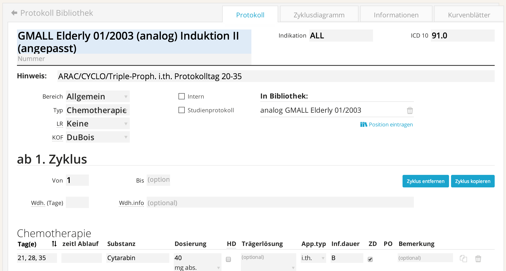
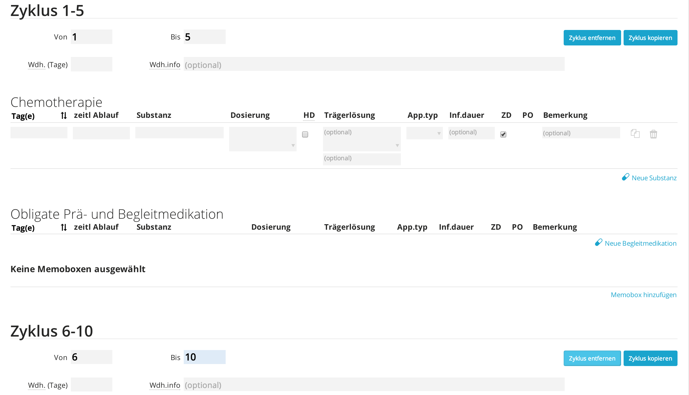
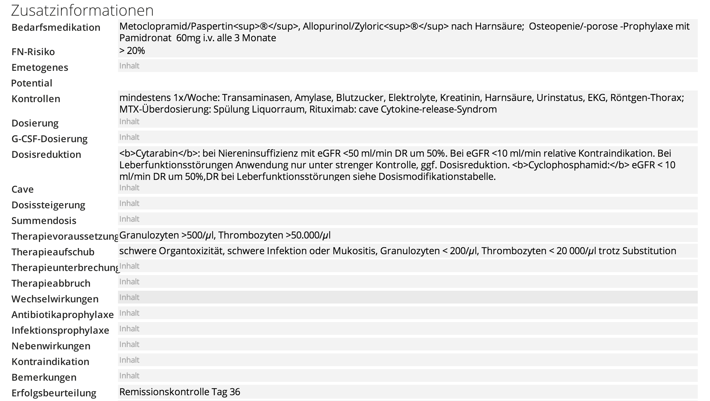
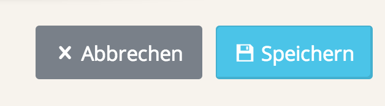

# Ein neues Protokoll anlegen

Das Anlegen neuer Protokolle dient dazu, klinik-/praxisinterne Protokolle anzulegen, welche vom bestehenden `ChemoCompile` Protokollbestand abweichen, bzw. diesen erweitern.
Ähnlich der Therapieplanung gibt es mehrere Wege, wie Sie ein neues Protokoll anlegen können:

- Ausgehend von einem “leeren Blatt”
- Ausgehend von einem bestehenden Protokoll

>☛ Um ein neues Protokoll ausgehend von einem “leeren Blatt” anzulegen, klicken Sie bitte auf `Neues Protokoll` im ChemoCompile `Hauptmenu`.

>☛ Um ein neues Protokoll ausgehend von einem bestehenden Protokoll anzulegen, wählen Sie das Protokoll im `Protokollbaum` aus (durch Klick auf `Protokolle` im `ChemoCompile` `Hauptmenu`) und klicken Sie auf den Button `Als Vorlage` am unteren Bereich des Protokolls.

Der Protokoll-Editor öffnet sich.

*Abb. 7.1:* Der `Protokoll-Editor`.

>☛ Geben Sie dem Protokoll im obersten Feld auf der linken Seite einen Namen

>☛ Geben Sie die weiteren Daten ein, die die Chemotherapie beinhalten soll (Indikation, ICD-10-Code, Hinweise, Bereich, Typ, etc..)

>☛ Klicken Sie auf `Position eintragen` um den Ort innerhalb des `Protokollbaums` festzulegen, wo das neue Protokoll gespeichert werden soll.

Sie können mit dem `Protokoll-Editor` Multi-Zyklen-Protokolle erstellen.

>☛ Geben Sie bei einem bestehenden Zyklus in die Felder `Von` und `Bis` passende Zahlen ein.

Beispielsweise würde dieselbe Therapie in Zyklus 1-5 verordnet, wenn Sie in den Feldern eine 1 und eine 5 eintragen.

>☛ Klicken Sie auf `Zyklus kopieren`, um eine sich davon unterscheidende Therapieverordnung zu erstellen, welche z.B. ab dem 6. Zyklus erfolgen soll. Mittels `Zyklus entfernen` können Sie den Zyklus wieder entfernen.

*Abb. 7.2:* Anlegen eines Multizyklen-Protokolls im `Protokoll-Editor`.

>☛ Füllen Sie die Details zur Therapieverordnung aus, ähnlich wie im Prozess der `Therapieplanung` (vgl. 5.1.1).

>☛ Klicken Sie auf `Memobox hinzufügen`, um ihrem Protokoll eine Memobox hinzuzufügen. Klicken Sie auf den `grauen Papierkorb` auf der rechten Seite, um Memoboxen zu entfernen.

>☛ Geben Sie im unteren Bereich des Protokolls Zusatzinformationen an.

*Abb. 7.3:* Eingabe von Zusatzinformationen für das Chemotherapie-Protokoll.

>☛ Wählen Sie zuletzt aus, ob es sich um ein `Chemo-` oder `Studienprotokoll` handelt, oder ob Sie hierzu keine Angaben machen möchten.

>☛ Nun können Sie das Protokoll `Speichern`.

*Abb. 7.4:* Speichern eines neu angelegten Protokolls.
