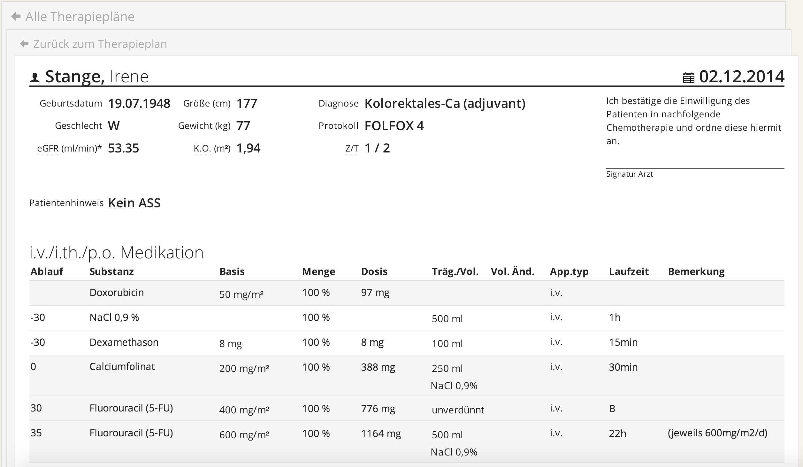

# Anpassung von Kurvenblättern

Mittels der im Kapitel 5.2. beschriebenen Übersicht über die geplante Therapie können Sie einzelne Kurvenblätter der Therapie anzeigen und anpassen.

Diese Funktion besteht erst, wenn eine Therapie freigegeben wurde (s. Kapitel 5.2).

>☛ Klicken Sie hierzu in der `Kalender-` oder `Listenansicht` ihrer Therapie auf ein bestimmtes Kurvenblatt.

Es erscheint ein Applikationsplan für den ausgewählten Tag, i.e. das Kurvenblatt des ausgewählten Tages.

*Abb. 5.6:* Ein Kurvenblatt einer bestimmten Therapie *(Patientendaten fiktiv)*. Im oberen Bereich des Kurvenblattes sehen Sie Optionen, um hierarchisch zurück zu springen: Klicken Sie hierfür auf `Zurück zum Therapieplan`, oder auf `Alle Therapiepläne`.

Unter dem Kurvenblatt gibt es mehrere Buttons.

>☛ Klicken Sie auf den Button `Bearbeiten`

*Abb. 5.6:* Der `Bearbeiten` Button

Nehmen Sie in der folgenden Ansicht Änderungen vor und klicken Sie anschließend auf `Speichern`.

Sie haben nun die Therapieverordnung eines einzelnen Tages geändert.

