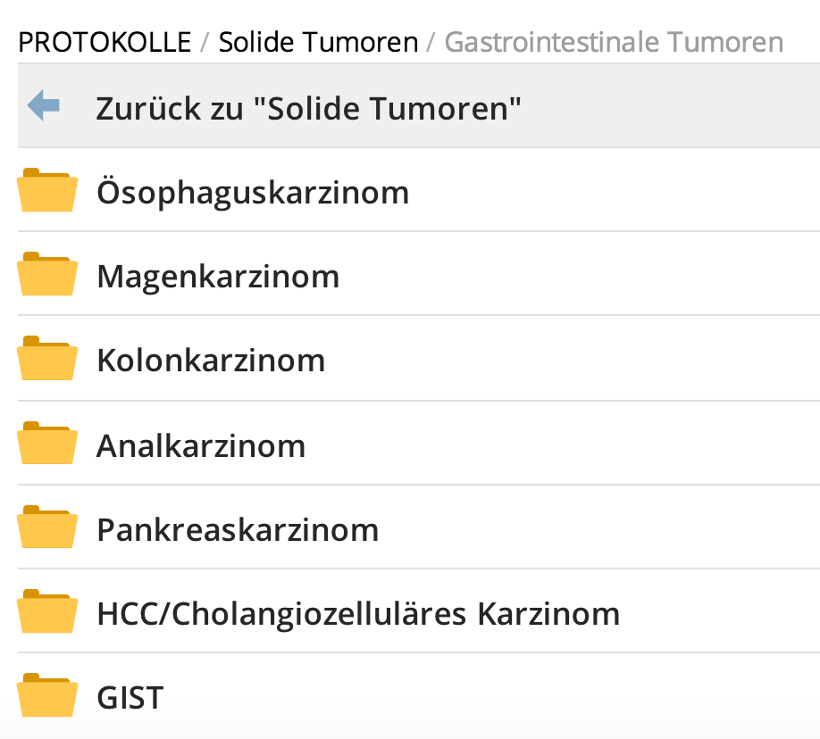

# Neue Therapie, ausgehend vom Protokollbaum

Die `ChemoCompile` Protokollsammlung bietet ein weitreichendes Repertoire an evidenzbasierten Chemotherapie Gabeschemata, welches einen alternativen Ausgangspunkt für die Chemotherapieplanung darstellt.

>☛ Klicken Sie auf `Protokolle` im `ChemoCompile` Hauptmenu.

Der Protokollbaum öffnet sich.

*Abb. 5.3:* Der Protokollbaum, eine hierarchisch geordnete Struktur der Chemotherapieprotokolle aus der `ChemoCompile`-Datenbank.

>☛ Klicken Sie sich hierarchisch durch den Protokollbaum, bis Sie das passende Chemotherapieprotokoll gefunden haben.

>☛ Um im Protokollbaum eine hierarchische Ebene zurück zu springen, klicken Sie auf den ersten Eintrag, welcher mit einem ⬅︎ versehen ist:

>☛ Wählen Sie ein bestimmtes Protokoll aus.

Das Protokoll wird Ihnen nun angezeigt.

>☛ Klicken Sie auf den Button `Verwenden`, um ausgehend von diesem Protokoll eine Therapie zu planen.

>☛ Zur weiteren Therapieplanung gehen Sie vor wie im Abschnitt 5.1.1 beschrieben.
