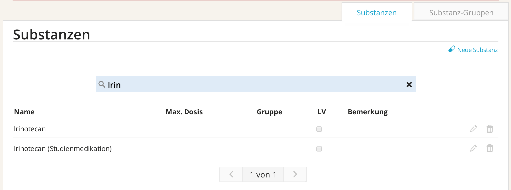
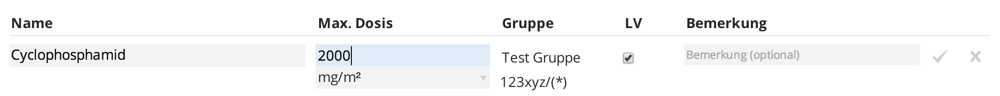
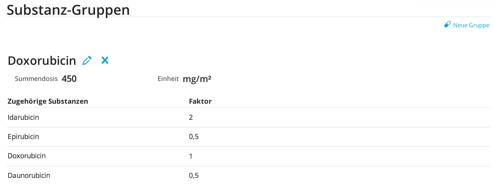

# Substanzen

Um neue Substanzen hinzuzufügen, welche beispielsweise neu am Markt sind und in einem neuen Protokoll verordnet werden sollen, oder bestehende Medikationen zu ersetzen, können Sie den `Substanzeditor` verwenden.

**Verwaltung von Einzelsubstanzen**

>☛ Klicken Sie auf `Verwalten` im `ChemoCompile` `Hauptmenu` und auf `Substanzen`

Im sich nun öffnenden `Substanzeditor` können Sie die Datenbank nach Substanzen durchsuchen.

*Abb. 8.1:* Der `Substanz-Editor`: Suche nach Substanzen.

>☛ Klicken Sie auf den `grauen Papierkorb` auf der rechten Seite, um ein Medikament aus dem Datenbestand von `ChemoCompile` zu löschen.

>☛ Klicken Sie auf den `grauen Bleistift` auf der rechten Seite, den bestehenden Eintrag zu verändern. Hierbei kann neben der Veränderung des Namens auch eine Maximaldosis verändert werden.

*Abb. 8.2:* Der `Substanz-Editor`: Einstellung einer Summendosis für ein bestimmtes Medikament.

>☛ Klicken Sie auf `Neue Substanz`, um eine neue Substanz anzulegen.

**Verwaltung von Substanz-Gruppen**

>☛ Klicken Sie oben rechts auf `Substanz-Gruppen`, um Substanz-Gruppen zu verwalten.

*Abb. 8.3:* `Substanz-Editor`: Verwaltung von Substanz-Gruppen.

>☛ Klicken Sie in diesem Bereich auf `Neue Gruppe`, um eine neue Substanz-Gruppe anzulegen.

>☛ Klicken Sie auf das blaue `x`, um eine Substanzgruppe zu löschen.

>☛ Klicken Sie auf den `blauen Bleistift`, um eine Substanzgruppe zu verändern.
